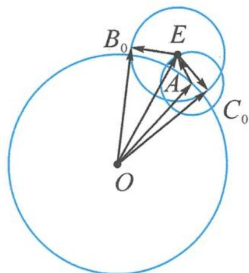

> [!faq]- 《浙大优辅《高中数学新体系 向量的秘密》》例题解析
>
> > [!success]- **【答案】** 详见解析
>
> > [!note]- **【分析】**
> > 分析 注意到要求的角 $\langle a + b + e, a + c + e \rangle$ 中有共同的元素 $a + e$ , 可视其为整体.
> >
> > 解答 记 $a=\overrightarrow{OA}, e=\overrightarrow{AE}$ ，则点 A 在以 O 为圆心，4 为半径的圆上运动，点 E 在以 A 为圆心，1 为半径的圆上运动，如图 4.2-7.
> >
> > 记 $b=\overrightarrow{EB}, c=\overrightarrow{EC}$ ，则点 B 和点 C 都在以 E 为圆心，2 为半径的圆上运动，所以问题变为求向量 $\overrightarrow{OB}$ 与 $\overrightarrow{OC}$ 夹角的最大值。
> >
> > 显然 OB, OC 恰为圆 E 的切线时, $\angle BOC$ 最大为 $2\angle EOB_{0}$ . 又因为 $\sin \angle EOB_{0} = \frac{B_{0}E}{OE} = \frac{2}{OE}$ , 故要使得角最大, 即要 OE 最小.
> >
> > 显然 $|\overrightarrow{OE}|_{\min} = 4 - 1 = 3$ ，所以 $(\sin \angle EOB_0)_{\max} = \frac{2}{3}$ ，即 $(\tan \angle EOB_0)_{\max} = \frac{2}{\sqrt{5}}.$ 所以
> >
> > 
> > 图4.2-7
> >
> > $$
> > (\tan \angle C _ {0} O B _ {0}) _ {\max} = \frac {2 \times \frac {2}{\sqrt {5}}}{1 - \frac {4}{5}} = 4 \sqrt {5}.
> > $$
> >
> > 点评 本题是例 8 的升级版,考点依然是圆的切线角最大,但对向量的几何作图能力提出了更高的要求.
> >
> > ## 4.2.3 数形结合,比翼齐飞
> >
> > 从代数与几何角度研究夹角问题,有助于培养数形结合的思想方法,提升数学运算和直观想象的核心素养.
>
> > [!note]- **【解析】**
> > 本题未单列解析。
