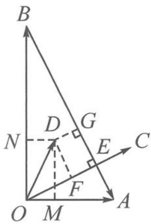
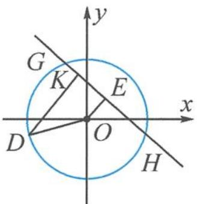
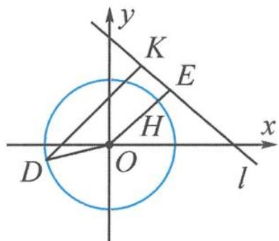

> [!faq]- 《浙大优辅《高中数学新体系 向量的秘密》》例题解析
>
> > [!success]- **【答案】** 详见解析
>
> > [!note]- **【分析】**
> > 分析 本题考查投影的概念,要确定投影数值 x, y, z 分别对应什么,并且明确目标式 $x^{2} + y^{2} + z^{2}$ 的意义.
> >
> > 解答 视角一:代数视角
> >
> > 建系设点, 设 $a=\overrightarrow{OA}=(1,0)$ , $b=\overrightarrow{OB}=(0,2)$ , $c=\overrightarrow{OC}=(2t,t)$ , $d=\overrightarrow{OD}=(x,y)$ , 则
> >
> > $$
> > z = \frac {(d - a) \cdot c}{| c |} = \frac {2 x - 2 + y}{\sqrt {5}}.
> > $$
> >
> > 故 $x^{2} + y^{2} + z^{2} = x^{2} + y^{2} + \left(\frac{2x - 2 + y}{\sqrt{5}}\right)^{2}$ .
> >
> > 处理一:二元函数主元配方
> >
> > $$
> > x ^ {2} + y ^ {2} + z ^ {2} = x ^ {2} + y ^ {2} + \left(\frac {2 x - 2 + y}{\sqrt {5}}\right) ^ {2} = \frac {6 y ^ {2} + (4 x - 4) y + 9 x ^ {2} - 8 x + 4}{5}
> > $$
> >
> > $$
> > \geqslant \frac {- \frac {2 (x - 1) ^ {2}}{3} + 9 x ^ {2} - 8 x + 4}{5} = \frac {5 x ^ {2} - 4 x + 2}{3} \geqslant \frac {2}{5}.
> > $$
> >
> > 当且仅当 $x=\frac{2}{5}$ , $y=\frac{1}{5}$ 时, $x^{2}+y^{2}+z^{2}$ 取到最小值 $\frac{2}{5}$ .
> >
> > 处理二:权方和不等式
> >
> > $$
> > \begin{array}{r l} x ^ {2} + y ^ {2} + z ^ {2} & = x ^ {2} + y ^ {2} + \left(\frac {2 x - 2 + y}{\sqrt {5}}\right) ^ {2} = \frac {(2 x) ^ {2}}{4} + \frac {y ^ {2}}{1} + \frac {(2 - 2 x - y) ^ {2}}{5} \\ & \geqslant \frac {(2 x + y + 2 - 2 x - y) ^ {2}}{4 + 1 + 5} = \frac {2}{5}. \end{array}
> > $$
> >
> > 当且仅当 $x=2y=\frac{2}{5}$ 时， $x^{2}+y^{2}+z^{2}$ 取到最小值 $\frac{2}{5}$ .
> >
> > 除了以上两种处理方式,还可以用求偏导法、柯西不等式、参数方程法等多种代数运算手段来求目标式 $x^{2}+y^{2}+z^{2}$ 的最小值.技巧多多,此处从略,关键要紧扣运算化简.
> >
> > 视角二: 几何视角
> >
> > 记 $a = \overrightarrow{OA}, b = \overrightarrow{OB}, c = \overrightarrow{OC}, d = \overrightarrow{OD}$ , 由条件可作出图形, 如图 4.3-1, 满足 $|\overrightarrow{OA}| = 1$ , $|\overrightarrow{OB}| = 2, OA \perp OB, OC \perp AB$ 于点 $E$ , 且 $|\overrightarrow{OE}| = \frac{2\sqrt{5}}{5}$ .
> >
> > 分别作出三个投影向量,则 d 在 a, b 方向上的投影向量的模 $\left|x\right|=\left|\overrightarrow{OM}\right|$ , $\left|y\right|=\left|\overrightarrow{ON}\right|$ , 故
> >
> > $$
> > x ^ {2} + y ^ {2} = | \overrightarrow {O M} | ^ {2} + | \overrightarrow {O N} | ^ {2} = | \overrightarrow {O D} | ^ {2}.
> > $$
> >
> > 又 $d - a$ 在 $c$ 方向上的投影向量的模
> >
> > $$
> > | z | = | \overrightarrow {E F} | = | \overrightarrow {G D} |,
> > $$
> >
> > 故
> >
> > $$
> > x ^ {2} + y ^ {2} + z ^ {2} = | \overrightarrow {O D} | ^ {2} + | \overrightarrow {G D} | ^ {2}.
> > $$
> >
> > 
> >
> > 至此,我们发现目标式 $x^{2}+y^{2}+z^{2}$ 的几何意义为两段长度的平方和.
> >
> > 图4.3-1
> >
> > 处理一: $x^{2} + y^{2} + z^{2} = |\overrightarrow{OD}|^{2} + |\overrightarrow{GD}|^{2} \geqslant \frac{(|\overrightarrow{OD}| + |\overrightarrow{GD}|)^{2}}{2} \geqslant \frac{|\overrightarrow{OE}|^{2}}{2} = \frac{2}{5}$ .
> >
> > 当 $|\overrightarrow{OD}| = |\overrightarrow{GD}| = \frac{|\overrightarrow{OE}|}{2}$ ，即点 $D$ 位于 $OE$ 中点时， $x^2 + y^2 + z^2$ 取得最小值 $\frac{2}{5}$ .
> >
> > 处理二:由于两段长度平方和的几何特征不明,故可采用解析几何的办法,用坐标运算算出结果.
> >
> > 以 $E$ 为原点， $EC$ 为 $x$ 轴， $EB$ 为 $y$ 轴建立坐标系 $xEy$ ，则 $O\left(-\frac{2\sqrt{5}}{5},0\right)$ . 设 $D(m,n)$ ，则
> >
> > $$
> > x ^ {2} + y ^ {2} + z ^ {2} = \left(m + \frac {2 \sqrt {5}}{5}\right) ^ {2} + n ^ {2} + m ^ {2} = 2 \left(m + \frac {\sqrt {5}}{5}\right) ^ {2} + n ^ {2} + \frac {2}{5} \geqslant \frac {2}{5}.
> > $$
> >
> > 当点 D 位于 OE 中点时, $x^{2}+y^{2}+z^{2}$ 取得最小值 $\frac{2}{5}$ .
> >
> > 处理三:要求 $x^{2}+y^{2}+z^{2}$ 的最小值,显然点 D 要落在 $\triangle ABC$ 内.注意到 $|x|=|\overrightarrow{ND}|$ .
> >
> > $|y|=|\overrightarrow{MD}|,|z|=|\overrightarrow{DG}|$ ，恰为 $\triangle ABC$ 内一点D到三边的距离，故由面积公式知 $S_{\triangle OAB}=1=$ $\frac{1}{2}\times2\times|x|+\frac{1}{2}\times1\times|y|+\frac{1}{2}\times\sqrt{5}\times|z|$ ，即
> >
> > $$
> > \vert x \vert + \frac {1}{2} \vert y \vert + \frac {\sqrt {5}}{2} \vert z \vert = 1.
> > $$
> >
> > 由柯西不等式知
> >
> > $$
> > (x ^ {2} + y ^ {2} + z ^ {2}) \left(1 + \frac {1}{4} + \frac {5}{4}\right) \geqslant \left(| x | + \frac {1}{2} | y | + \frac {\sqrt {5}}{2} | z |\right) ^ {2} = 1.
> > $$
> >
> > 故 $x^{2} + y^{2} + z^{2}\geqslant \frac{2}{5}.$
> >
> > 处理四:其实,用前面的代数视角解决时,遇到的目标式 $x^{2}+y^{2}+\left(\frac{|2x-2+y|}{\sqrt{5}}\right)^{2}$ 也有几何意义,可将其看成点 $D(x,y)$ 到 $O(0,0)$ 的距离平方与到直线 $l:2x+y-2=0$ 的距离平方的和.
> >
> > ①如图 4.3-2, 当直线 l 与以 O 为圆心, $\left|\overrightarrow{OD}\right|$ 为半径的圆相交或相切时, $\left|OD\right| \geqslant \left|OE\right| = \frac{2\sqrt{5}}{5}$ .
> >
> > $$
> > x ^ {2} + y ^ {2} + z ^ {2} = O D ^ {2} + D K ^ {2} \geqslant O D ^ {2} \geqslant \frac {4}{5},
> > $$
> >
> > 当且仅当直线 l 与圆 O 相切时取得等号.
> >
> > 
> > 图4.3-2
> >
> > 
> > 图4.3-3
> >
> > ②如图 4.3-3, 当直线 l 与以 O 为圆心, $\left|\overrightarrow{OD}\right|$ 为半径的圆相离时, 记 $r = \left|\overrightarrow{OD}\right| < \frac{2\sqrt{5}}{5}$ .
> >
> > $$
> > \begin{array}{r l} x ^ {2} + y ^ {2} + z ^ {2} & = O D ^ {2} + D K ^ {2} \geqslant O D ^ {2} + H E ^ {2} \\ & = O D ^ {2} + (O E - O H) ^ {2} = r ^ {2} + \left(\frac {2 \sqrt {5}}{5} - r\right) ^ {2} \\ & = 2 r ^ {2} - \frac {4 \sqrt {5}}{5} r + \frac {4}{5} \geqslant \frac {2}{5}. \end{array}
> > $$
> >
> > 综上,目标条件 $x^{2}+y^{2}+z^{2}$ 的最小值为 $\frac{2}{5}$ .
> >
> > 点评 解本题的关键在于对向量投影概念的理解.从代数视角,写出坐标形式下的投影值的定义式,将原问题转化为求二元函数的最值问题.从几何视角,作出垂线找到投影,将 $x^{2}+y^{2}+z^{2}$ 转化为两段距离之和.后续化简求解的方式多样,能考查学生处理多变量问题的能力.
>
> > [!note]- **【解析】**
> > 本题未单列解析。
