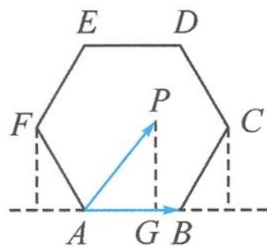

> [!faq]- 《浙大优辅《高中数学新体系 向量的秘密》》例题解析
>
> > [!success]- **【答案】** A
>
> > [!note]- **【分析】**
> > 本题未单列分析。
>
> > [!note]- **【解析】**
> > 解答 $\overrightarrow{AP} \cdot \overrightarrow{AB} = |\overrightarrow{AP}| |\overrightarrow{AB}| \cos \theta = 2 \times |\overrightarrow{AP}| \cos \theta$ , 问题转化为求 $\overrightarrow{AP}$ 在 $\overrightarrow{AB}$ 上的投影值 $|\overrightarrow{AP}| \cos \theta$ 的大小.
> > 如图 4.3-6, 显然, 当点 P 在点 C 时, 最大投影值为 3; 当点 P 在点 F 时, 最小投影值为 -1. 故选 A.
> > 
> > 图4.3-6
> > 点评 将本题的静态问题变成了动态问题,求数量积的取值范围.解题
> > 过程正好说明,有一个模长固定的数量积问题可以转化为投影问题,作出投影是关键.
> > ## 4.3.3 投影与实数之间的联系
