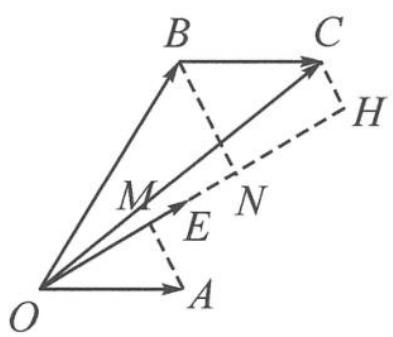
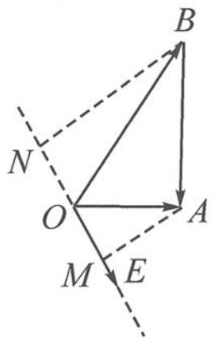

> [!faq]- 《浙大优辅《高中数学新体系 向量的秘密》》例题解析
>
> > [!success]- **【答案】** 详见解析
>
> > [!note]- **【分析】**
> > 分析 题干中出现的 $|a \cdot e|$ 和 $|b \cdot e|$ ，既可以理解为两个实数，又可以看成两个投影向量的模（投影值的绝对值），于是就有了数与形两种解法。
> >
> > 解答 解法一:由实数恒等式 $|x|+|y|=\max\{|x+y|,|x-y|\},x,y\in\mathbb{R}$ ，知
> >
> > $$
> > \left| \boldsymbol {a} \cdot \boldsymbol {e} \right| + \left| \boldsymbol {b} \cdot \boldsymbol {e} \right| = \max \{\left| (\boldsymbol {a} + \boldsymbol {b}) \cdot \boldsymbol {e} \right|, \left| (\boldsymbol {a} - \boldsymbol {b}) \cdot \boldsymbol {e} \right| \}.
> > $$
> >
> > 当 e 与 $a + b$ 或 a - b 中模长更大的向量共线时， $|a \cdot e| + |b \cdot e|$ 取得最大值。由 $|a| = 1$ ， $|b|=2, a \cdot b=1$ 知
> >
> > $$
> > \vert a + b \vert = \sqrt {7}, \vert a - b \vert = \sqrt {3}.
> > $$
> >
> > 故 $|a \cdot e| + |b \cdot e|$ 的最大值为 $\sqrt{7}$ .
> >
> > 解法二: 记 $a=\overrightarrow{OA}, b=\overrightarrow{OB}, e=\overrightarrow{OE}$ ，则 $\angle AOB=\frac{\pi}{3}$ .
> >
> > (1)如图 4.3-7, 当 $\overrightarrow{OA}, \overrightarrow{OB}$ 在 $\overrightarrow{OE}$ 上的投影向量同向时, 分别作出 $a \cdot e = |\overrightarrow{OM}|$ , $b \cdot e = |\overrightarrow{ON}|$ , 则
> >
> > $$
> > \left| \boldsymbol {a} \cdot \boldsymbol {e} \right| + \left| \boldsymbol {b} \cdot \boldsymbol {e} \right| = \left| \overrightarrow {O M} \right| + \left| \overrightarrow {O N} \right|.
> > $$
> >
> > 作 $\overrightarrow{BC} = \overrightarrow{OA}$ ，则 $\overrightarrow{BC},\overrightarrow{OA}$ 在 $\overrightarrow{OE}$ 上的投影值相等，即 $|\overrightarrow{OM}| = |\overrightarrow{NH} |$ ，故
> >
> > $$
> > | \boldsymbol {a} \cdot \boldsymbol {e} | + | \boldsymbol {b} \cdot \boldsymbol {e} | = | \overrightarrow {O M} | + | \overrightarrow {O N} | = | \overrightarrow {N H} | + | \overrightarrow {O N} | = | \overrightarrow {O H} | \leqslant | \overrightarrow {O C} |.
> > $$
> >
> > 又 $|\overrightarrow{OC}| = \sqrt{7}$ ，故 $(|a\cdot e| + |b\cdot e|)_{\max} = \sqrt{7}$
> >
> > 
> > 图4.3-7
> >
> > 
> > 图4.3-8
> >
> > (2)如图4.3-8,当 $\overrightarrow{OA},\overrightarrow{OB}$ 在 $\overrightarrow{OE}$ 上的投影向量反向时,
> >
> > $$
> > \vert \boldsymbol {a} \cdot \boldsymbol {e} \vert + \vert \boldsymbol {b} \cdot \boldsymbol {e} \vert = \vert \overrightarrow {O M} \vert + \vert \overrightarrow {O N} \vert = \vert \overrightarrow {M N} \vert \leqslant \vert \overrightarrow {A B} \vert = \sqrt {3}.
> > $$
> >
> > 综上， $(|a\cdot e| + |b\cdot e|)_{\max} = \sqrt{7}$
> >
> > 点评 本题实际上是教材中向量数量积分配律证明过程的翻版,核心为平面内两个向量向某一向量分别作投影,那么投影之和等于和之投影.投影向量的模长之和的最大值为这两个向量构成的平行四边形中较长对角线的长度.
>
> > [!note]- **【解析】**
> > 本题未单列解析。
