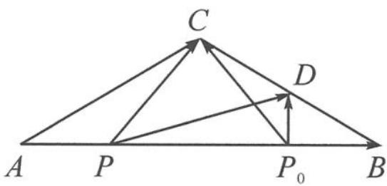

> [!faq]- 《浙大优辅《高中数学新体系 向量的秘密》》例题解析
>
> > [!success]- **【答案】** D
>
> > [!note]- **【分析】**
> > 分析 首先要读懂题中代数式 $\overrightarrow{PB} \cdot \overrightarrow{PC} \geqslant \overrightarrow{P_{0}B} \cdot \overrightarrow{P_{0}C}$ 的含义.随着点P的运动,数量积 $\overrightarrow{PB} \cdot \overrightarrow{PC}$ 随之变化,并且存在最小值 $\overrightarrow{P_{0}B} \cdot \overrightarrow{P_{0}C}$ ,当点P位于点 $P_{0}$ 时取得.伸出两根手指分别想象成两个向量 $\overrightarrow{PB},\overrightarrow{PC}$ .当点P在边AB上变化时,始终保持指尖连线 $|BC|$ 不变,故选取极化恒等式就合情合理了.
> >
> > 解答 如图 5.4-2, 取 BC 的中点 D, 连接 PD, 则
> >
> > $$
> > \mid \overrightarrow {P D} \mid^ {2} - \frac {\mid \overrightarrow {B C} \mid^ {2}}{4} \geqslant \mid \overrightarrow {P _ {0} D} \mid^ {2} - \frac {\mid \overrightarrow {B C} \mid^ {2}}{4},
> > $$
> >
> > 
> >
> > 所以 $|\overrightarrow{PD}|^2 \geqslant |\overrightarrow{P_0D}|^2$ ，即 $|\overrightarrow{PD}| \geqslant |\overrightarrow{P_0D}|$ .
> >
> > 图5.4-2
> >
> > 故 $P_{0}D \perp AB$ ，且 $P_{0}$ 是 $AB$ 的四等分点，所以 $AC = BC$ . 故选 D.
> >
> > 点评 本题的难点在于作出那条看似从天而降的中线 $PD$ , 如果对极化恒等式没有深刻的认识, 是难以作出这条辅助线的.
> >
> > 【剪刀手模型3】伸出两根手指分别想象成两个向量 $\overrightarrow{OA},\overrightarrow{OB}$ ，若指尖连线 $|\overrightarrow{AB} |$ 的长度已知，则将其看作三角形的底边，学会作中线是解题的关键.可以总结口诀：知道指尖连线长——转极化.
>
> > [!note]- **【解析】**
> > 本题未单列解析。
