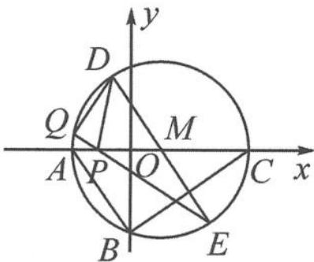

> [!faq]- 《浙大优辅《高中数学新体系 向量的秘密》》例题解析
>
> > [!success]- **【答案】** 详见解析
>
> > [!note]- **【分析】**
> > 本题未单列分析。
>
> > [!note]- **【解析】**
> > 
> > 解答 在 Rt△ABC 中, 由 OA=2, OB=2√2 及 OB²=AO·CO, 得 OC=4, 故 ⊙M 的直径为 6, 且 M(1,0), P(-1,0). 由极化恒等式知
> > 图5.4-3
> > $$
> > \overrightarrow {P D} \cdot \overrightarrow {P E} = | \overrightarrow {P M} | ^ {2} - \frac {1}{4} | \overrightarrow {D E} | ^ {2} = 4 - \frac {1}{4} \times 3 6 = - 5.
> > $$
