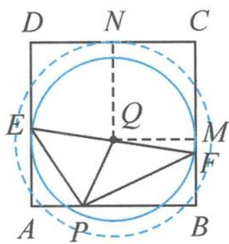

> [!faq]- 《浙大优辅《高中数学新体系 向量的秘密》》例题解析
>
> > [!success]- **【答案】** C
>
> > [!note]- **【分析】**
> > 本题未单列分析。
>
> > [!note]- **【解析】**
> > 解答 因为 $EF=\sqrt{37}$ 为定值, 所以优先考虑使用极化恒等式视角. 取 EF 的中点 Q, 则 $\overrightarrow{PE} \cdot \overrightarrow{PF} = |\overrightarrow{PQ}|^{2} - \frac{|\overrightarrow{EF}|^{2}}{4} = \lambda$ , 故
> > $$
> > | \overrightarrow {P Q} | ^ {2} = \frac {3 7}{4} + \lambda .
> > $$
> > 以 $Q$ 为圆心， $\sqrt{\frac{37}{4} + \lambda}$ 为半径作圆与正方形四边有6个交点.如图5.4-4，虚线圆与实线圆之间的圆都满足条件，即 $QM < r < QN$ .故
> > $$
> > 3 <   \sqrt {\frac {3 7}{4} + \lambda} <   \frac {7}{2},
> > $$
> > 
> > 图5.4-4
> > 解得 $-\frac{1}{4}<\lambda<3$ .
> >
> > 故选 **C**.
