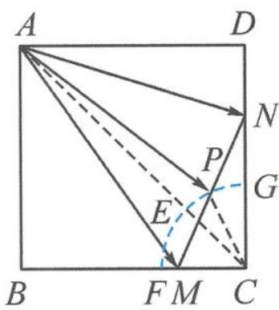

> [!faq]- 《浙大优辅《高中数学新体系 向量的秘密》》例题解析
>
> > [!success]- **【答案】** 详见解析
>
> > [!note]- **【分析】**
> > 本题未单列分析。
>
> > [!note]- **【解析】**
> > 解答 When, Where: 伸出两根手指, 看到指尖连线 $|\overrightarrow{MN}| = \sqrt{2}$ 为定值.
> > What: 确定用极化视角解决.
> > How: 添中线, 写出极化恒等式.
> > 取 $MN$ 的中点 $P$ , 则 $\overrightarrow{AM} \cdot \overrightarrow{AN} = |\overrightarrow{AP}|^2 - \frac{|\overrightarrow{MN}|^2}{4} = |\overrightarrow{AP}|^2 - \frac{1}{2}$ .
> > 因为 $\triangle MNC$ 为直角三角形, $CP$ 是斜边上的中线且等于斜边的一半,即 $|CP|=\frac{|MN|}{2}=\frac{\sqrt{2}}{2}$ ,故点 $P$ 在以 $C$ 为圆心, $\frac{\sqrt{2}}{2}$ 为半径的 $\frac{1}{4}$ 圆弧 $\widehat{FEG}$ 上运动,如图5.6-2.
> > 
> > 故 $|\overrightarrow{AE}| \leqslant |\overrightarrow{AP}| \leqslant |\overrightarrow{AG}|$ ，即 $\frac{9}{2} \leqslant |\overrightarrow{AP}|^2 \leqslant \frac{17}{2} - 2\sqrt{2}$ ，所以 $\overrightarrow{AM} \cdot \overrightarrow{AN} \in [4, 8 - 2\sqrt{2}]$ .
> > 图5.6-2
> > Why: 反思过程中的每一步是否合理, 其实原理在之前的建“模”过程中都已研究.
