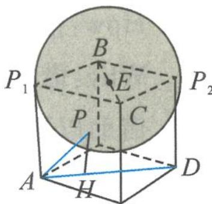

> [!faq]- 《浙大优辅《高中数学新体系 向量的秘密》》例题解析
>
> > [!success]- **【答案】** 详见解析
>
> > [!note]- **【分析】**
> > 本题未单列分析。
>
> > [!note]- **【解析】**
> > 解答 如图 5.6-3, 不妨先将正四面体放入外接正方体中. 设 BC 的中点为 E, 连接 PE, 由 $\left|\overrightarrow{PB} + \overrightarrow{PC}\right| = 2$ 得 $\left|\overrightarrow{PE}\right| = 1$ , 可知点 P 在以 E 为球心, 1 为半径的球面上运动.
> > When, Where: 伸出两根手指, 看到一根手指长 $|\overrightarrow{AD}|$ 为定值.
> > 
> > What: 选用数量积的投影视角解决问题.
> > 图5.6-3
> > How: 确定 AD 为“地平线”, 过点 P 作 AD 的垂线, 视为“太阳光”, 则 $\overrightarrow{AH}$ 就是投影向量. 显然, 当点 P 位于点 $P_{1}, P_{2}$ 时, 投影值分别取得最小值 0, 最大值 2, 故 $\overrightarrow{AP} \cdot \overrightarrow{AD} \in [0, 4]$ . Why: 请反思巩固每一个环节.
