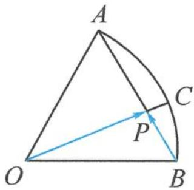
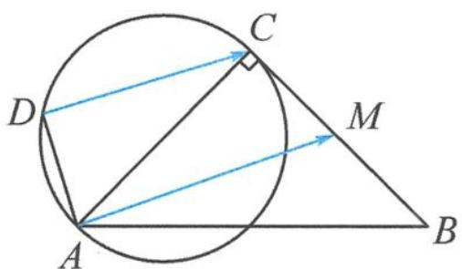

<!-- question-source:start -->
7. 如图, 在半径为 1 的扇形 $AOB$ 中, 已知 $\angle AOB = 60^{\circ}, C$ 为弧 $AB$ 上的动点, $AB$ 与 $OC$ 交于点 $P$ , 则 $\overrightarrow{OP} \cdot \overrightarrow{BP}$ 的最小值为 \_\_\_\_.

第 7 题图

第8题图
<!-- question-source:end -->

![[Q00034311A1]]
