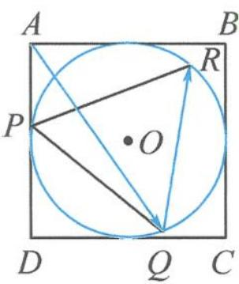

<!-- question-source:start -->
10. 如图, 已知圆 $O$ 是边长为 4 的正方形 $ABCD$ 的内切圆, $\triangle PQR$ 是圆 $O$ 的内接正三角形. 若 $\triangle PQR$ 绕着圆心 $O$ 旋转, 则 $\overrightarrow{AQ} \cdot \overrightarrow{QR}$ 的最大值为 \_\_\_\_.

第10题图
<!-- question-source:end -->

![[Q00034314A1]]
