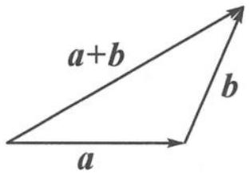
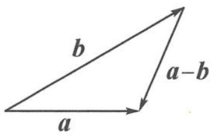

## 6.2 向量三角不等式

在三角形中,“两边之和大于第三边,两边之差小于第三边”是我们熟知的结论.若我们用向量的语言“翻译”这个结论,会收获怎样的惊喜呢?

图6.2-1

图6.2-2

当向量 a, b 不共线时, 由图 6.2-1, 我们得到

$$
\mid | a \mid - | b \mid | <   | a + b | <   | a | + | b |;
$$

由图 6.2-2, 我们得到

$$
\mid | a \mid - | b \mid | <   | a - b | <   | a | + | b |.
$$

综上,我们得到:

## 向量三角不等式

$$
\left| \left| a \right| - \left| b \right| \right| \leqslant \left| a \pm b \right| \leqslant \left| a \right| + \left| b \right|,
$$

当向量 a, b 共线时取等号.

主要用于处理向量“和”、“差”的模长问题. 特别地, 我们有一维形式的三角不等式: 推论: 设 $x, y \in \mathbb{R}$ , 则

$$
\left| \left| x \right| - \left| y \right| \right| \leqslant \left| x \pm y \right| \leqslant \left| x \right| + \left| y \right|.
$$

更本质的,我们有如下结论:

设 $x, y \in \mathbf{R}$ , 则

$$
| x | + | y | = \max \{| x + y |, | x - y | \}, | | x | - | y | | = \min \{| x + y |, | x - y | \}.
$$

![[高中/总复习/专题/高考数学秘密/浙大优辅《高中数学新体系 向量的秘密》/14_6_2_向量三角不等式/questions/Q00034317.md]]
![[高中/总复习/专题/高考数学秘密/浙大优辅《高中数学新体系 向量的秘密》/14_6_2_向量三角不等式/questions/Q00034318.md]]
