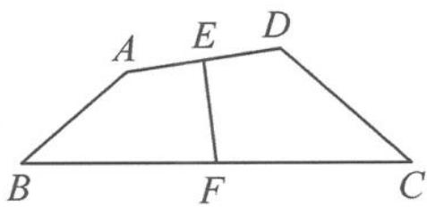

> [!faq]- 《浙大优辅《高中数学新体系 向量的秘密》》例题解析
>
> > [!success]- **【答案】** 详见解析
>
> > [!note]- **【分析】**
> > 本题未单列分析。
>
> > [!note]- **【解析】**
> > 
> > 图6.4-2
> > 解答 注意到题干中出现了两组不共起点的数量积和一系列的长度,所以由向量对角线定理得
> > $$
> > m = \frac {1}{2} (A C ^ {2} + B D ^ {2} - 2 - 3), n = \frac {1}{2} (A D ^ {2} + B C ^ {2} - 2 - 3),
> > $$
> > 所以
> > $$
> > m - n = \frac {1}{2} (A C ^ {2} + B D ^ {2} - A D ^ {2} - B C ^ {2}) = \overrightarrow {A B} \cdot \overrightarrow {D C}.
> > $$
> > 由回路法得
> > $$
> > \overrightarrow {A B} = \overrightarrow {A E} + \overrightarrow {E F} + \overrightarrow {F B}, \overrightarrow {D C} = \overrightarrow {D E} + \overrightarrow {E F} + \overrightarrow {F C}.
> > $$
> > 两式相加得(也可由第1讲中的中线模型直接得到)
> > $$
> > \overrightarrow {A B} + \overrightarrow {D C} = 2 \overrightarrow {E F}.
> > $$
> > 平方得 $2 + 3 + 2\overrightarrow{AB}\cdot \overrightarrow{DC} = 4.$ 故 $\overrightarrow{AB}\cdot \overrightarrow{DC} = -\frac{1}{2}$ ，所以
> > $$
> > m - n = - \frac {1}{2}.
> > $$
