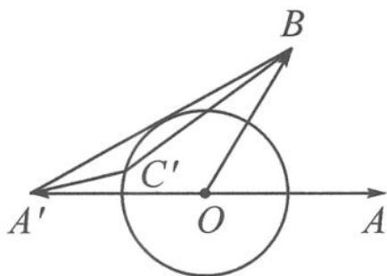

> [!faq]- 《浙大优辅《高中数学新体系 向量的秘密》》例题解析
>
> > [!success]- **【答案】** 详见解析
>
> > [!note]- **【分析】**
> > 本题未单列分析。
>
> > [!note]- **【解析】**
> > 解答 因为 $|a| = |c|$ , 由互换系数恒等式知
> > $$
> > \left| \frac {1}{2} a + c \right| = \left| a + \frac {1}{2} c \right|.
> > $$
> > 
> > 如图 6.5-2, 记 $a=\overrightarrow{OA}, -a=\overrightarrow{OA'}$ , $b=\overrightarrow{OB}, \frac{1}{2}c=\overrightarrow{OC'}$ , 则
> > 图6.5-2
> > $$
> > \left| \boldsymbol {a} + \frac {1}{2} \boldsymbol {c} \right| + \left| \boldsymbol {b} - \frac {1}{2} \boldsymbol {c} \right| = \left| \frac {1}{2} \boldsymbol {c} - (- \boldsymbol {a}) \right| + \left| \frac {1}{2} \boldsymbol {c} - \boldsymbol {b} \right| = | \overrightarrow {A ^ {\prime} C ^ {\prime}} | + | \overrightarrow {B C ^ {\prime}} |.
> > $$
> > (即求动点 $C'$ 到两定点 $A'$ , B 的距离之和)
> > 由于 $A^{\prime}O=OB=1,\angle A^{\prime}OB=120^{\circ}$ ，所以 $A^{\prime}B$ 恰为圆 O 的切线。由“三角形的两边之和大于第三边”知，当点 $C^{\prime}$ 运动至切点时， $\left|\overrightarrow{A^{\prime}C^{\prime}}\right|+\left|\overrightarrow{BC^{\prime}}\right|$ 达到最小值 $\left|\overrightarrow{A^{\prime}B}\right|=\sqrt{3}$ 。故 $\left|\frac{1}{2}a+c\right|+\left|b-\frac{1}{2}c\right|$ 的最小值为 $\sqrt{3}$ 。
> > 点评 本题使用互换系数恒等式后,使数形结合变得更加容易.如互换系数后使用向量三角不等式求最小值,常见的有两种情形.
> > 情形 1: $\left|a+\frac{1}{2}c\right|+\left|b-\frac{1}{2}c\right|\geqslant\left|a+b\right|=\sqrt{3}$ .
> > 情形 2: $\left|\frac{1}{2}a+c\right|+\left|-\frac{1}{2}b+c\right|\geqslant\left|\frac{1}{2}a+\frac{1}{2}b\right|=\frac{\sqrt{3}}{2}.$
> > 这告诉我们,使用向量三角不等式求最值时,必须验证等号是否能取到.情形1取等号的情况即本题解答过程中数形结合的解法.作图发现,情形2的等号是取不到的.
