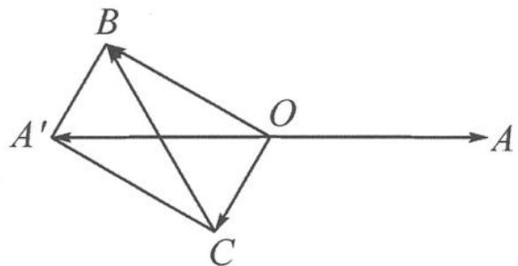

> [!faq]- 《浙大优辅《高中数学新体系 向量的秘密》》例题解析
>
> > [!success]- **【答案】** 详见解析
>
> > [!note]- **【分析】**
> > 本题未单列分析。
>
> > [!note]- **【解析】**
> > 解答 令 $a = \overrightarrow{OA}, b = \overrightarrow{OB}, c = \overrightarrow{OC}$ , 则
> > $$
> > \boldsymbol {b} + \boldsymbol {c} = - \boldsymbol {a} = \overrightarrow {O A ^ {\prime}}, \boldsymbol {b} - \boldsymbol {c} = \overrightarrow {O B} - \overrightarrow {O C} = \overrightarrow {C B}.
> > $$
> > 可以先画出一个平行四边形 $OBA^{\prime}C$ , 如图 7.1-2. 因为 $|a|=2, |b-c|=2$ 表示 $|\overrightarrow{OA^{\prime}}|=|\overrightarrow{CB}|=2$ , 所以平行四边形的对角线相等, 该平行四边形 $OBA^{\prime}C$ 是矩形. 所以 $|b|^{2}+|c|^{2}=$
> > ## 4, 得
> > $$
> > | \pmb {b} | + | \pmb {c} | \leqslant 2 \sqrt {2}.
> > $$
> > 当且仅当 $|b| = |c| = \sqrt{2}$ 时取到最大值 $2\sqrt{2}$ .
> > 
> > 图7.1-2
> > 点评 几何图形能让我们知道抽象的代数式究竟表达何种意思,它是抽象到直观的必经之路,也是处理向量问题的上佳选择.
> > 向量的几何法首要步骤是画图. 向量的加、减符合三角形法则和平行四边形法则, 因此可以像上面的例 1, 例 2 这样刻画出三角形和平行四边形. 其实, 还有其他一系列的基本图形可以被向量刻画. 下面我们就一起来梳理更多的基本图形, 找找那些熟悉或不熟悉的几何元素.
