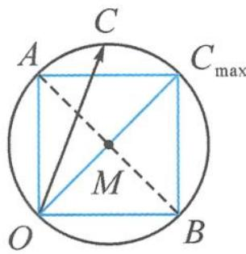

> [!faq]- 《浙大优辅《高中数学新体系 向量的秘密》》例题解析
>
> > [!success]- **【答案】** C
>
> > [!note]- **【分析】**
> > 本题未单列分析。
>
> > [!note]- **【解析】**
> > 解答 记 $a=\overrightarrow{OA}, b=\overrightarrow{OB}, c=\overrightarrow{OC}$ ，其中
> > $$
> > \overrightarrow {O A} \perp \overrightarrow {O B}, | \overrightarrow {O A} | = | \overrightarrow {O B} | = 1, | \boldsymbol {a} - \boldsymbol {b} | = | \overrightarrow {B A} | = \sqrt {2}.
> > $$
> > 由 $(a - c)\cdot (b - c) = 0$ 得
> > $$
> > \overrightarrow {C A} \cdot \overrightarrow {C B} = 0.
> > $$
> > 
> > 从而动点 $C$ 的轨迹是以线段 $AB$ 为直径的圆, 如图7.2-3.由图易得, $|c|$ 的最大值是 $\sqrt{2}$ . 故选C.
> > 图7.2-3
> > 点评 解本题的关键是理解 $(a-c)\cdot(b-c)=0$ ，通过“以大换小”，用有向线段来表示向量,从而实现代数条件的几何化.实际上,本题条件 $a \perp b$ 可以去掉,答案亦然,请读者自行证明.
