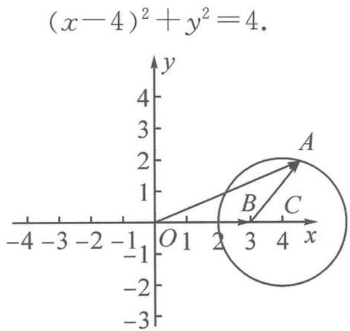

> [!faq]- 《浙大优辅《高中数学新体系 向量的秘密》》例题解析
>
> > [!success]- **【答案】** 详见解析
>
> > [!note]- **【分析】**
> > 本题未单列分析。
>
> > [!note]- **【解析】**
> > 解答 记 $a=\overrightarrow{OA}, b=\overrightarrow{OB}$ ，由 $|a|=2|a-b|$ ，即 $|\overrightarrow{OA}|=2|\overrightarrow{BA}|$ 知，点 A 的轨迹是阿氏圆。如图 7.2-6，以 O 为原点，OB 为 x 轴建立坐标系，则 $B(3,0), A(x,y)$ ，于是
> > $$
> > \sqrt {x ^ {2} + y ^ {2}} = 2 \sqrt {(x - 3) ^ {2} + y ^ {2}}.
> > $$
> > 化简得
> > 
> > 图7.2-6
> > 所以圆心为 $C(4,0)$ , 半径为 2. 记 $\lambda b = \overrightarrow{OD}$ , 则点 $D$ 在直线 $OB$ 上运动,
> > $$
> > \left| \boldsymbol {a} - \lambda \boldsymbol {b} \right| = \left| \overrightarrow {D A} \right|.
> > $$
> > $|a-\lambda b|\geqslant4$ 即 $\left|\overrightarrow{DA}\right|_{\min}\geqslant4$ ，故 $x_{D}\leqslant-2$ 或 $x_{D}\geqslant10$ 。又 $\lambda b=\overrightarrow{OD}$ ，故
> > $$
> > \lambda = \frac {x _ {D}}{x _ {B}} \in \left(- \infty , - \frac {2}{3} \right] \cup \left[ \frac {1 0}{3}, + \infty\right).
> > $$
> > 点评 解本题的关键是理解 $|a| = 2 |a - b|$ , 利用“以大换小”将代数条件几何化, 变为 $|\overrightarrow{OA}| = 2 |\overrightarrow{BA}|$ , 对应平面上一个动点到两个定点距离的比值为不等 1 的定值, 联想到阿氏圆的定义而作图. 用解析几何求轨迹方程的方式确定阿氏圆的方程是常用方法.
