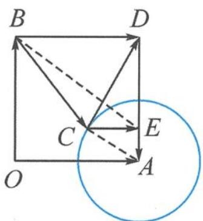

> [!faq]- 《浙大优辅《高中数学新体系 向量的秘密》》例题解析
>
> > [!success]- **【答案】** 详见解析
>
> > [!note]- **【分析】**
> > 本题未单列分析。
>
> > [!note]- **【解析】**
> > 解答 记 $a = \overrightarrow{OA}, b = \overrightarrow{OB}, c = \overrightarrow{OC}, a + b = \overrightarrow{OD}$ , 由 $|c - a| = \frac{1}{2}$ 知, 点 $C$ 在以 $A$ 为圆心, $\frac{1}{2}$ 为半径的圆上, 如图7.2-9. 显然
> > $$
> > \vert a + b - c \vert + 2 \vert c - b \vert = \vert \overrightarrow {C D} \vert + 2 \vert \overrightarrow {B C} \vert = 2 \left(\frac {\vert \overrightarrow {C D} \vert}{2} + \vert \overrightarrow {B C} \vert\right).
> > $$
> > 
> > 图7.2-9
> > 取线段 AD 的四等分点 E（想一想为什么取这个点?），则 $AE=\frac{1}{4}$ . 因为 $\frac{AE}{AC}=\frac{AC}{AD}=\frac{1}{2}$ ， $\angle CAE = \angle DAC$ , 所以
> > $$
> > \triangle C A E \sim \triangle D A C.
> > $$
> > 所以 $\frac{CE}{CD}=\frac{1}{2}$ ，即 $CE=\frac{1}{2}CD$ 。所以
> > $$
> > \vert a + b - c \vert + 2 \vert c - b \vert = 2 \left(\frac {| \overrightarrow {C D} |}{2} + | \overrightarrow {B C} |\right) = 2 \left(| \overrightarrow {C E} | + | \overrightarrow {B C} |\right) \geqslant 2 \vert \overrightarrow {B E} \vert = 2 \sqrt {1 ^ {2} + \left(\frac {3}{4}\right) ^ {2}} = \frac {5}{2}.
> > $$
> > 点评 解本题的关键在于阿氏圆的逆用. 平时正面求阿氏圆比较多, 到两定点的距离之比等于定值的点的轨迹是阿氏圆. 本题考查了它的逆用, 圆上的点到两个定点的距离之比为定值, 求定点. 要注意, 阿氏圆的比值与定点是相关联的, 所以不是所有的圆和一个定点明确, 就一定能找到另一个定点的, 与比值有关.
> > ## (4)外接圆
> > 平面内,与两个定点连接所成的角为定值(或其补角)的点的轨迹(含两个定点)是圆的一部分,由此定义了外接圆.
> > 定义 4 若向量 $a \in \alpha (\alpha$ 是平面)，满足 $\langle a - c, a - b \rangle = \theta_{0}$ ，其中定向量 $b, c \in \alpha, |b - c| = m$ 为定值，则称向量 a 确定平面 $\alpha$ 上的外接圆（弧），其直径为 $\frac{|b - c|}{\sin \theta_{0}}$ .
