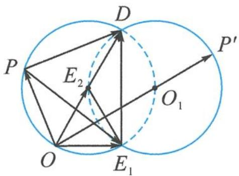

> [!faq]- 《浙大优辅《高中数学新体系 向量的秘密》》例题解析
>
> > [!success]- **【答案】** 详见解析
>
> > [!note]- **【分析】**
> > 本题未单列分析。
>
> > [!note]- **【解析】**
> > 解答 如图 7.2-11, 记 $e_1 = \overrightarrow{OE_1}$ , $e_2 = \overrightarrow{OE_2}$ , $p = \overrightarrow{OP}$ , 由 $e_1 \cdot e_2 = \frac{1}{2}$ 知, $\triangle OE_1E_2$ 为正三角形. $e_1 - p$ 与 $e_2 - \frac{1}{2}p$ 的夹角为 $\frac{\pi}{3}$ , 即 $e_1 - p$ 与 $2e_2 - p$ 的夹角为 $\frac{\pi}{3}$ .
> > 
> > 图7.2-11
> > 记 $2e_{2} = \overrightarrow{OD}$ , 即 $\angle DPE_{1} = \frac{\pi}{3}$ . 因为 $|DE_{1}| = \sqrt{3}$ 为定值, 所以点 $P$ 的轨迹为两段圆弧 (挖掉两点). 故
> > $$
> > \left| O P \right| _ {\max} = \left| O O _ {1} \right| + \left| O _ {1} P ^ {\prime} \right| = \sqrt {3} + 1.
> > $$
> > 所以 $|p|\in [0,\sqrt{3} +1]$
> > 点评 “定弦对定角”的圆模型其实是两段圆弧,常常会误以为只有一段圆弧,因此思考要周全.
> > ## (5)二次圆
