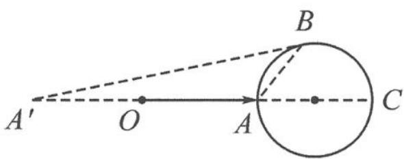

> [!faq]- 《浙大优辅《高中数学新体系 向量的秘密》》例题解析
>
> > [!success]- **【答案】** 详见解析
>
> > [!note]- **【分析】**
> > 本题未单列分析。
>
> > [!note]- **【解析】**
> > 解答 对二次式 $b^{2}-3a\cdot b+8=0$ 进行配方得 $\left(b-\frac{3}{2}a\right)^{2}=1$ ，即
> > $$
> > \left| \boldsymbol {b} - \frac {3}{2} \boldsymbol {a} \right| = 1.
> > $$
> > 如图 7.2-12, 记 $a=\overrightarrow{OA}, b=\overrightarrow{OB}, -a=\overrightarrow{OA'}$ , 则
> > $$
> > \vert \boldsymbol {b} - (- \boldsymbol {a}) \vert + \vert \boldsymbol {a} - \boldsymbol {b} \vert = \vert \overrightarrow {A ^ {\prime} B} \vert + \vert \overrightarrow {A B} \vert .
> > $$
> > 当点 B 与点 A 重合时, 取值最小, 最小值为 4;
> > 
> > 图7.2-12
> > 当点 B 与点 C 重合时, 取值最大, 最大值为 8.
> > 故 $|a+b|+|a-b|$ 的取值范围是[4,8].
