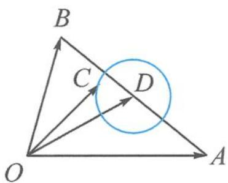

> [!faq]- 《浙大优辅《高中数学新体系 向量的秘密》》例题解析
>
> > [!success]- **【答案】** 详见解析
>
> > [!note]- **【分析】**
> > 本题未单列分析。
>
> > [!note]- **【解析】**
> > 解答 对二次式进行配方得
> > $$
> > (a - c) \cdot (b - c) = c ^ {2} - (a + b) \cdot c + a \cdot b = \left(c - \frac {a + b}{2}\right) ^ {2} - \left(\frac {a - b}{2}\right) ^ {2} = \left(c - \frac {a + b}{2}\right) ^ {2} - \frac {9}{4} = - 2.
> > $$
> > 整理得
> > $$
> > \left| c - \frac {a + b}{2} \right| = \frac {1}{2}.
> > $$
> > 如图 7.2-13, 记 $a=\overrightarrow{OA}, b=\overrightarrow{OB}, c=\overrightarrow{OC}$ , 线段 AB 的中点为 D, 则点 C 在以 D 为圆心, $\frac{1}{2}$ 为半径的圆上运动,
> > 
> > $$
> > \vert \overrightarrow {O D} \vert^ {2} = \left(\frac {\boldsymbol {a} + \boldsymbol {b}}{2}\right) ^ {2} = \frac {\boldsymbol {a} ^ {2} + \boldsymbol {b} ^ {2} + \frac {7}{2}}{4} = \frac {(\boldsymbol {a} - \boldsymbol {b}) ^ {2} + 7}{4} = 4.
> > $$
> > 图7.2-13
> > 所以 $|\overrightarrow{OD}| = 2$ .故
> > $$
> > | \boldsymbol {c} | = | \overrightarrow {O C} | \in \left[ 2 - \frac {1}{2}, 2 + \frac {1}{2} \right] = \left[ \frac {3}{2}, \frac {5}{2} \right].
> > $$
> > 以上与大家分享了如何识别圆与画圆,为方便大家记忆和理解,特作打油诗一首作为小结:同是一个圆,表征各有方.模长即距离,夹角定方向.
> > 定长标准圆,直角直径圆.定比阿氏圆,定角外接圆.
> > 二次有玄机,一般表示圆.定义是源头,理解活水来.
> > ## 7.2.2 基本图形二: 引入参数, 激活图形——向量与直线
> > ## (1) 所在直线
