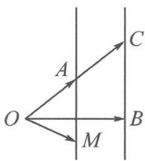

> [!faq]- 《浙大优辅《高中数学新体系 向量的秘密》》例题解析
>
> > [!success]- **【答案】** 详见解析
>
> > [!note]- **【分析】**
> > 本题未单列分析。
>
> > [!note]- **【解析】**
> > 解答 如图 7.2-17, 记 $a = \overrightarrow{OA}, b = \overrightarrow{OB}, 2a = \overrightarrow{OC}$ , 则 $b \cdot (2a - b) = 0$ 即 $\overrightarrow{OB} \perp \overrightarrow{BC}$ . 于是点 $C$ 的轨迹就是过点 $B$ 且与 $OB$ 垂直的垂线. 又
> > $$
> > \left| t \boldsymbol {b} + (1 - 2 t) \boldsymbol {a} \right| = \left| \boldsymbol {a} + t (\boldsymbol {b} - 2 \boldsymbol {a}) \right| = \left| \overrightarrow {O A} + t \overrightarrow {C B} \right| = \left| \overrightarrow {O M} \right|,
> > $$
> > 
> > 故点 M 的轨迹就是过点 A 且与 BC 平行的平行线.
> > 所以 $\left|tb+(1-2t)a\right|$ 的最小值为 $\frac{1}{2}\left|\overrightarrow{OB}\right|=1$ .
> > 图7.2-17
> > 点评 垂线体现的垂直性质与向量数量积为 0 恰好吻合, 因此数量积为零可以用来刻画垂线. 类似地, 投影也可以刻画垂直, 例如本题条件若改为 $a \cdot b = 1$ , 也能刻画点 $A$ 的轨迹为垂线.
> > (4)三点共线
