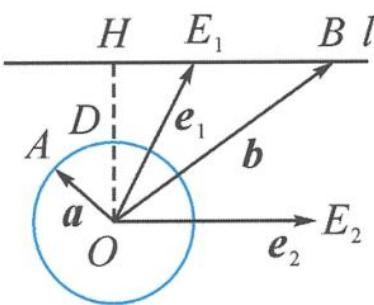
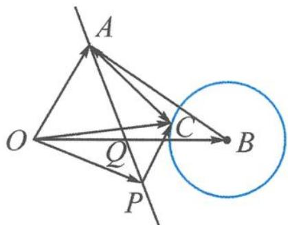

> [!faq]- 《浙大优辅《高中数学新体系 向量的秘密》》例题解析
>
> > [!success]- **【答案】** 详见解析
>
> > [!note]- **【分析】**
> > 本题未单列分析。
>
> > [!note]- **【解析】**
> > 解答 令 $a = \overrightarrow{OA}, b = \overrightarrow{OB}, e_1 = \overrightarrow{OE_1}, e_2 = \overrightarrow{OE_2}$ , 如图7.3-6.
> > $b=e_{1}+ke_{2}(k\in\mathbf{R})$ 表示点 B 在 $OE_{2}$ 的平行线 l 上运动；
> > $|a|=\frac{\sqrt{3}}{4}$ 表示点A在以O为圆心, $\frac{\sqrt{3}}{4}$ 为半径的圆上运动; $|a-b|\geqslant\frac{\sqrt{3}}{4}$ 恒成立表示 $|AB|_{\min}\geqslant\frac{\sqrt{3}}{4}$ .
> > 
> > 图7.3-6
> > 设 $\theta$ 为 $e_1$ 与 $e_2$ 的夹角, 显然, 当 $OB \perp l$ , 即点 $B$ 在点 $H$ 处时, $|OH| = \sin \theta$ . 故
> > $$
> > \left| A B \right| _ {\min} = \left| D H \right| = \sin \theta - \frac {\sqrt {3}}{4} \geqslant \frac {\sqrt {3}}{4},
> > $$
> > 即 $\sin \theta \geqslant \frac{\sqrt{3}}{2}$ , 可得 $\theta \in \left[\frac{\pi}{3}, \frac{2\pi}{3}\right]$ .
> > 编题 4 如图 7.3-7, 如果引入直线 AP, $\overrightarrow{OP} = \lambda \overrightarrow{OA} + (1 - \lambda) \overrightarrow{OQ}$ , 即 $p = \lambda a + (1 - \lambda) \cdot \frac{b}{2}$ ,
> > 求 $|p-c|$ 的最小值.
> > 
> > 图7.3-7
