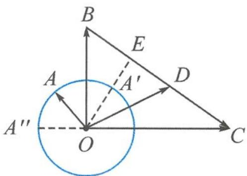

> [!faq]- 《浙大优辅《高中数学新体系 向量的秘密》》例题解析
>
> > [!success]- **【答案】** 详见解析
>
> > [!note]- **【分析】**
> > 本题未单列分析。
>
> > [!note]- **【解析】**
> > 解答 如图 7.3-8, 令 $a=\overrightarrow{OA}, b=\overrightarrow{OB}, c=\overrightarrow{OC}$ , 则点 A 在单位圆上运动.
> > 记 $\overrightarrow{OD}=\lambda\boldsymbol{b}+(1-\lambda)\boldsymbol{c},0<\lambda<1$ ，则点D在线段BC上.
> > $|a-\lambda b-(1-\lambda)c|=|\overrightarrow{OA}-\overrightarrow{OD}|=|\overrightarrow{DA}|$ 表示单位圆上的点A到线段BC上的点D的距离.
> > 当 $OE \perp BC$ 时，设 $A'$ 为 OE 与圆的交点，则 $\left|AD\right|_{\min} = \frac{6}{\sqrt{13}} - 1$ ;
> > 
> > 当 A 取 CO 延长线与圆 O 的交点 $A''$ 时， $|AD|_{\max}=3+1=4$ .
> > 图7.3-8
> > 故 $\left|a-\lambda b-(1-\lambda)c\right|\in\left[\frac{6\sqrt{13}}{13}-1,4\right)$ .
> > 取不到的值的集合为 $\left(-\infty,\frac{6\sqrt{13}}{13}-1\right)\cup[4,+\infty)$ .
> > 至此,相信大家也注意到了,解题时我们要将抽象的向量代数式转化为直观的几何图形,而命题则恰恰相反,要将添加的几何图形包装成向量的代数形式.因此,熟练掌握常见的几何元素的向量表达方式,就可以编出丰富多彩的向量问题.当然,除了模长,数量积也常常作为考查的目标式.
