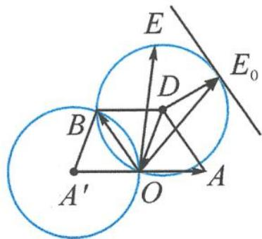
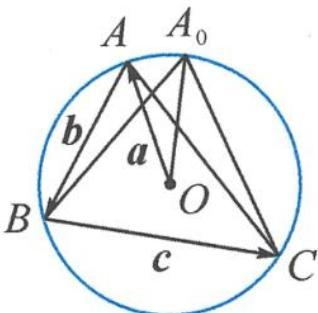

> [!faq]- 《浙大优辅《高中数学新体系 向量的秘密》》例题解析
>
> > [!success]- **【答案】** 详见解析
>
> > [!note]- **【分析】**
> > 本题未单列分析。
>
> > [!note]- **【解析】**
> > 解答 首先理解“×”运算的含义, 记 $a = \overrightarrow{OA}, b = \overrightarrow{OB}$ , 则 $|a \times b| = |a||b|\sin \langle a, b \rangle$ 显然就是求 $\triangle OAB$ 面积的两倍.
> > 接下来我们来看条件中所给的向量代数式, $|a|=|a+b|=|a+b+c|=1$ 到底蕴含着怎样的几何图形,可以有以下两种画法.
> > 画法一:如图 7.4-1,首先,画 $a=\overrightarrow{OA},|\overrightarrow{OA}|=1$ .
> > 其次, 记 $b = \overrightarrow{OB}$ , 则 $|a + b| = |b - (-a)| = |\overrightarrow{A'B}| = 1$ , 作出点 $A$ 关于点 $O$ 的对称点 $A'$ , 则点 $B$ 在以点 $A'$ 为圆心, 1 为半径的圆上运动.
> > 最后, 记 $c = \overrightarrow{OC}, -c = \overrightarrow{OE}$ , 则 $|a + b + c| = |a + b - (-c)| = |\overrightarrow{OD} - \overrightarrow{OE}| = |\overrightarrow{ED}| = 1$ , 则点 $E$ 在以 $D$ 为圆心, 1 为半径的圆上运动.
> > 所以 $|\pmb{b} \times \pmb{c}| = |\overrightarrow{OB}| - \overrightarrow{OE}|\sin (\pi - \angle BOE) = 2S_{\triangle OBE}$ .
> > 这时我们好好地看一下这个图(图 7.4-1),会惊喜地发现,在图中有很多平行四边形(更准确地说是菱形,这是由两个圆的半径相等带来的).
> > 注意到点 B 和点 E 是各自运动, 所以“两动”问题, 采取“一定一动, 先定后动”的原则, 不妨让点 B 先在 $\odot A'$ 上定下来. 记 $\angle BOA' = \theta$ , 则 $|\overrightarrow{OB}| = 2\cos \theta$ . 再让点 E 在 $\odot D$ 上运动, 当点 E 位于点 $E_{0}$ 时 ( $E_{0}$ 为平行于 OB 的切线与圆 D 的切点), $S_{\triangle OBE}$ 达到最大, 最大值为
> > 
> > 图7.4-1
> > $$
> > (S _ {\triangle O B E}) _ {\max} = \frac {1}{2} \times 2 \cos \theta \times (\sin \theta + 1) = \frac {1}{2} \sin 2 \theta + \cos \theta .
> > $$
> > 再让点 B 动起来, 即改变 $\angle BOA' = \theta$ 的大小, 求 $(S_{\triangle OBE})_{\max} = \frac{1}{2} \sin 2\theta + \cos \theta$ 的最大值.
> > $$
> > S ^ {\prime} = \cos 2 \theta - \sin \theta = 1 - 2 \sin^ {2} \theta - \sin \theta = - (2 \sin \theta - 1) (\sin \theta + 1).
> > $$
> > 故当 $\theta=\frac{\pi}{6}$ 时， $S_{\triangle OBE}$ 取得最大值的最大值 $\frac{3\sqrt{3}}{4}$ ，所以 $|b\times c|$ 的最大值为 $\frac{3\sqrt{3}}{2}$ .
> > 画法二: 注意到 $\left|a\right|=\left|a+b\right|=\left|a+b+c\right|=1$ , 可令 $a=\overrightarrow{OA}, a+b=\overrightarrow{OB}, a+b+c=\overrightarrow{OC}$ ，则点 A, B, C 都在单位圆上运动. 解得 $b=\overrightarrow{OB}-\overrightarrow{OA}=\overrightarrow{AB}, c=\overrightarrow{OC}-\overrightarrow{OB}=\overrightarrow{BC}$ .
> > 如图 7.4-2, 发现 $\left|b \times c\right| = 2S_{\triangle ABC}$ , 问题转化为求单位圆内接三角形面积的最大值.
> > 根据对称性猜想单位圆内接三角形面积的最大值在三角形是正三角形时取得, 故 $S_{\max} = \frac{3 \sqrt{3}}{4}$ , 则 $|b \times c|$ 的最大值为 $\frac{3 \sqrt{3}}{2}$ .
> > 
> > 图7.4-2
> > 如果要严格证明,可以设 BC=2t,则 $(S_{\triangle ABC})_{\max}=\frac{1}{2}\times2t(1+\sqrt{1-t^{2}})=t(1+\sqrt{1-t^{2}})$ .
> > 再对 t 进行三角换元或者求导易得, 当 $t=\frac{\sqrt{3}}{2}$ , 即 $\triangle A_{0}BC$ 为正三角形时, 单位圆内接三角形面积取得最大值 $\frac{3\sqrt{3}}{4}$ .
> > 点评 本题是一道典型的几何画图题,我们可以发现两种常见的画法.
> > 第一种是直接“以大换小”采取共起点出发型画法, 设 $a = \overrightarrow{OA}, b = \overrightarrow{OB}, c = \overrightarrow{OC}$ , 然后把题中
> > 给出的代数条件转化为几何图形.从图形上看,画图总是共起点,遵循平行四边形法则.
> > 第二种则是从题干给出的代数条件入手, 整体“以大换小”, 设 $a = \overrightarrow{OA}, a + b = \overrightarrow{OB}, a + b + c = \overrightarrow{OC}$ , 然后解出 $a = \overrightarrow{OA}, b = \overrightarrow{AB}, c = \overrightarrow{BC}$ . 从图形上看, 画图是首尾相接, 遵循三角形法则.
> > 这是对模长的两种理解视角带来的两种画法,在第4讲的模长专题中已有介绍.
