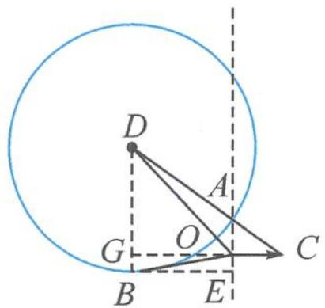
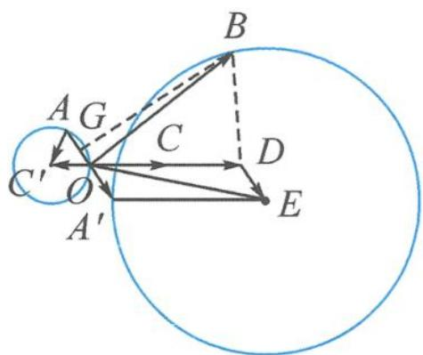

> [!faq]- 《浙大优辅《高中数学新体系 向量的秘密》》例题解析
>
> > [!success]- **【答案】** 详见解析
>
> > [!note]- **【分析】**
> > 本题未单列分析。
>
> > [!note]- **【解析】**
> > $$
> > c = \overrightarrow {A C}, \text { 且 } \overrightarrow {O A} \perp \overrightarrow {O C}.
> > $$
> > 由 $|c|=1$ 知 $|AC|=1$ , 故画出一个斜边长为 1 的 Rt△OAC. 于是 $-2c=\overrightarrow{AD}, a-2c=\overrightarrow{OD}$ . 记 $-b=\overrightarrow{OB}$ , 则
> > $$
> > \vert a + b - 2 c \vert = \vert (a - 2 c) - (- b) \vert = \vert \overrightarrow {B D} \vert = 2.
> > $$
> > 故点 B 在以 D 为圆心,2 为半径的圆上运动,要求 $a \cdot b$ 的最大值,即求 $\overrightarrow{OA} \cdot \overrightarrow{OB}$ 的最小值的相反数.
> > 如图 7.4-3, 显然, 当点 B 处的切线 BE 恰好垂直于直线 OA 时, OB 在 OA 上的投影数量最小为 $-|OE| = -|GB| = -(2 - 3|a|)$ , 故
> > $$
> > (\overrightarrow {O A} \cdot \overrightarrow {O B}) _ {\min} = - (2 - 3 | \boldsymbol {a} |) \cdot | \boldsymbol {a} | = 3 | \boldsymbol {a} | ^ {2} - 2 | \boldsymbol {a} | = 3 \left(| \boldsymbol {a} | - \frac {1}{3}\right) ^ {2} - \frac {1}{3} \geqslant - \frac {1}{3}.
> > $$
> > 所以 $(a \cdot b)_{\max} = \frac{1}{3}.$
> > 
> > 图7.4-3
> > 
> > 图7.4-4
> > 画法二: 将 $a \cdot (a + c) = 0$ 看成圆.
> > $a \cdot (a + c) = 0$ 即 $\left|a + \frac{c}{2}\right| = \frac{1}{2}.$
> > 如图 7.4-4, 记 $a = \overrightarrow{OA}, c = \overrightarrow{OC}, -\frac{c}{2} = \overrightarrow{OC'}$ , 则点 $A$ 在以 $C'$ 为圆心, $\frac{1}{2}$ 为半径的圆上运动.
> > 接着画 $-a = \overrightarrow{OA'}$ , $2c = \overrightarrow{OD}$ , 则 $2c - a = \overrightarrow{OE}$ . 由 $|a + b - 2c| = |b - (2c - a)| = 2$ 得, 点 $B$ 在以 $E$ 为圆心, $2$ 为半径的圆上运动.
> > 后续做法基本同画法一.
> > 点评 本题的两种画法源自对数量积为0的理解,既可以看成垂直,也可以看成是圆.
> > 仿照教材中用向量法解决几何问题的三步曲,我们可以得到借助几何直观解决向量问题的三步曲.
> > 第一步 以大换小,代数转入几何——小字母向量变为大字母向量;
> > 第二步 动笔画图,探寻几何元素——画出各条件表征的几何元素;
> > 第三步 借助运算,定性转向定量——几何元素之间构建联系桥梁.
> > 最后仅以一首打油诗作为本讲的小结.
> > 以大换小重塑向量条件,几何语言描绘图中乾坤.
> > 几何直观辅助代数抽象,数形结合自是妙不可言.
