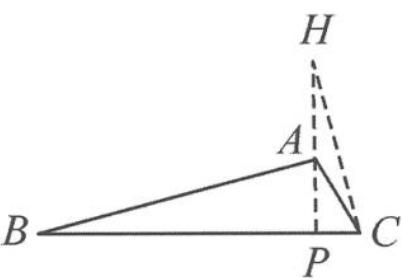

<!-- question-source:start -->
7. 如图, 记 $\triangle ABC$ 的垂心为 $H$ , 角 $A$ 为钝角, $AH = 2$ , $AC = \frac{2\sqrt{3}}{3}$ , $\overrightarrow{AH} \cdot \overrightarrow{AB} = -2$ . $P$ 是边 $BC$ 上一点, 且对任意的 $x \in \mathbb{R}$ , $|\overrightarrow{CA} - x\overrightarrow{CP}| \geqslant |\overrightarrow{CA} - \overrightarrow{CP}|$ 恒成立, 则 $|\overrightarrow{CP}| =$ \_\_\_\_.

<!-- question-source:end -->

![[Q00034372A1]]
