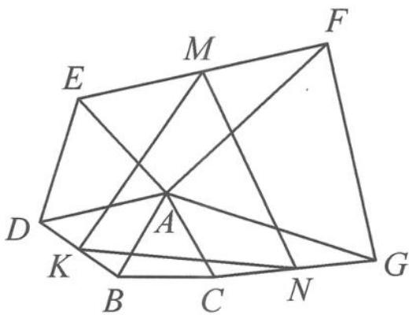

<!-- question-source:start -->
7. 如图, 已知 $\triangle ABC$ 为正三角形, 以 $A$ 为顶点向外作正三角形 $ADE$ 和正三角形 $AGF$ , 连接 $EF, BD, CG$ , 取 $EF, DB, CG$ 的中点 $M, K, N$ . 证明: $\triangle KNM$ 为正三角形.

<!-- question-source:end -->

![[Q00034406A1]]
