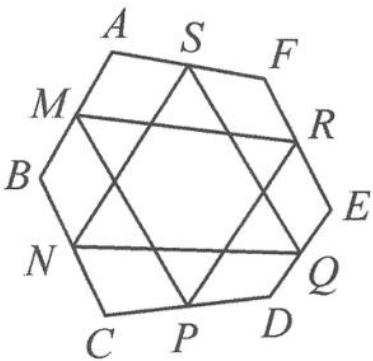

<!-- question-source:start -->
7. 如图, 若凸六边形 $ABCDEF$ 的边 $AB, BC, CD, DE, EF, FA$ 的中点分别为 $M, N, P, Q, R, S$ . 问: $\triangle MPR$ 与 $\triangle NQS$ 的重心是否重合? 请说明理由.

第 7 题图
<!-- question-source:end -->

![[Q00034439A1]]
