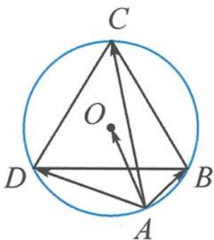

<!-- question-source:start -->
13. 如图, 设正三角形 $BCD$ 的外接圆 $O$ 的半径为 $R\left(\frac{1}{2} < R < \frac{\sqrt{3}}{3}\right)$ , 点 $A$ 在 $BD$ 下方的圆弧上, 则 $\left(\overrightarrow{AO} - \frac{\overrightarrow{AB}}{|\overrightarrow{AB}|} - \frac{\overrightarrow{AD}}{|\overrightarrow{AD}|}\right) \cdot \overrightarrow{AC}$ 的最小值为 \_\_\_\_.

<!-- question-source:end -->

![[Q00034445A1]]
