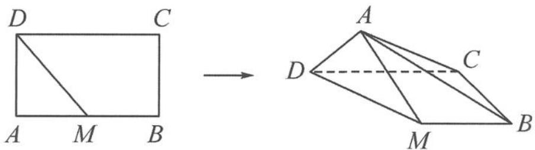

<!-- question-source:start -->
4. 如图, 在矩形 $ABCD$ 中, 已知 $AB = 2$ , $AD = 1$ , $M$ 是 $AB$ 的中点, 将 $\triangle ADM$ 沿 $DM$ 翻折, 在翻折过程中, 当二面角 $A - BC - D$ 的平面角最大时, 其正切值为 \_\_\_\_.

第4题图
<!-- question-source:end -->

![[Q00034469A1]]
