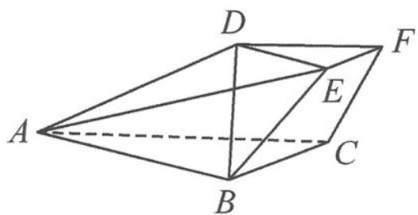

<!-- question-source:start -->
5. 如图, 在三棱台 $ABC-DEF$ 中, 已知平面 $ACFD \perp$ 平面 $ABC$ , $AB=AD=2DE=3$ , $BC=\sqrt{3}$ , $AC=3\sqrt{2}$ , $CF=\frac{\sqrt{6}}{2}$ .

(1) 证明: $CA \perp BD$ .

第5题图

(2)求直线 AE 与平面 ABC 所成角的正弦值.
<!-- question-source:end -->

![[Q00034470A1]]
