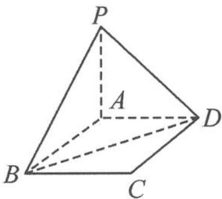

<!-- question-source:start -->
7. 如图, 设 $P$ 为矩形 $ABCD$ 所在平面外的一点, 直线 $PA \perp$ 平面 $ABCD$ , $AB = 3$ , $BC = 4$ , $PA = 1$ . 求点 $P$ 到直线 $BD$ 的距离.

第7题图
<!-- question-source:end -->

![[Q00034472A1]]
