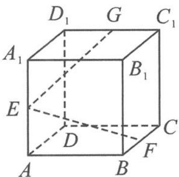

<!-- question-source:start -->
9. 如图, 已知正方体 $ABCD-A_{1}B_{1}C_{1}D_{1}$ 的棱长为 $1, E, F, G$ 分别是棱 $AA_{1}, BC, C_{1}D_{1}$ 的中点. 设 $M$ 是该正方体表面上的点, 若 $\overrightarrow{EM}=x\overrightarrow{EF}+y\overrightarrow{EG}$ ( $x, y \in \mathbb{R}$ ), 则点 $M$ 的轨迹长度是 \_\_\_\_.

<!-- question-source:end -->

![[Q00034474A1]]
