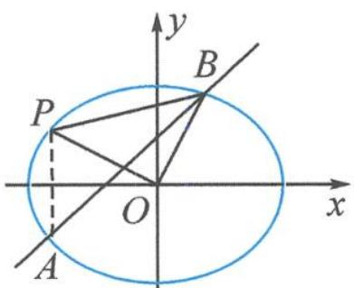
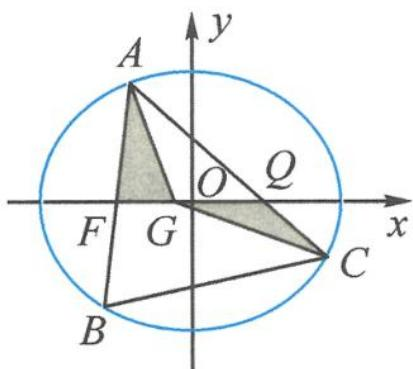

<!-- question-source:start -->
1. 如图, 直线 $l: y = x + 1$ 与椭圆 $C: \frac{x^2}{a^2} + \frac{y^2}{b^2} = 1 (a > b > 0)$ 交于 $A, B$ 两点, 记点 $A$ 关于 $x$ 轴的对称点为 $P$ , 且 $\triangle OBP$ 的面积为 2 , 则 $\frac{1}{a^2} + \frac{1}{b^2} =$ \_\_\_\_.

第1题图

第3题图
<!-- question-source:end -->

![[Q00034490A1]]
