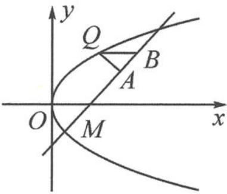

<!-- question-source:start -->
6. 已知抛物线 $C: y^{2} = 4x$ 上的一点 $M(1, -2)$ . 如图, 动点 $Q$ 在抛物线 $C$ 上, 直线 $l$ 过点 $M$ , 点 $A, B$ 在 $l$ 上, 且满足 $QA \perp l, QB \parallel x$ 轴. 若 $\frac{|MB|^{2}}{|MA|}$ 为常数, 求直线 $l$ 的方程.

第6题图
<!-- question-source:end -->

![[Q00034495A1]]
