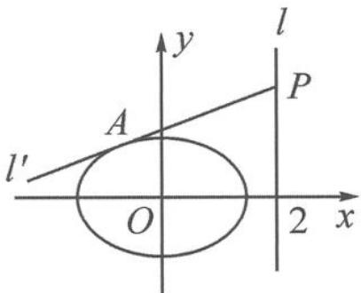

<!-- question-source:start -->
9. 如图, 已知椭圆 $C: \frac{x^2}{2} + y^2 = 1$ , 若 $O$ 为坐标原点, $P$ 为直线 $l: x = 2$ 上的动点, 过点 $P$ 作直线 $l'$ , 与椭圆相切于点 $A$ . 若 $\triangle POA$ 的面积 $S = \frac{\sqrt{2}}{2}$ , 求直线 $l'$ 的方程.

第9题图
<!-- question-source:end -->

![[Q00034498A1]]
