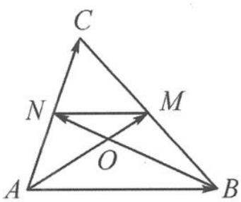

<!-- question-source:start -->
2. 解答 以 $\overrightarrow{AM}=m,\overrightarrow{BN}=n$ 为基底.
依题意， $|m|=2,|n|=3,m\cdot n=-3\sqrt{3}.$

第2题答图

如答图， $\triangle MON \sim \triangle AOB$ ，
则 $\overrightarrow{AB} = \overrightarrow{AO} + \overrightarrow{OB} = \frac{2}{3} (m - n)$ ， $\overrightarrow{AC} = 2 \overrightarrow{AN} = 2 (\overrightarrow{AO} + \overrightarrow{ON}) = \frac{2}{3} (2m + n)$ ， $\overrightarrow{AB} \cdot \overrightarrow{AC} = \frac{2}{3} (m - n) \cdot \frac{2}{3} (2m + n) = \frac{12\sqrt{3} - 4}{9}$ .
<!-- question-source:end -->

![[Q00034536A1]]
