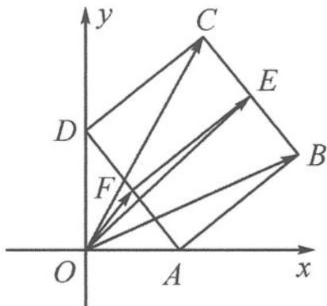

<!-- question-source:start -->
9. 解答 因为 $\left|\overrightarrow{BC}\right|=1$ 为定值, 所以用极化恒等式求解.

如答图, 取 BC 的中点 E,
则 $\overrightarrow{OB}\cdot\overrightarrow{OC}=|\overrightarrow{OE}|^{2}-\frac{|\overrightarrow{BC}|^{2}}{4}=|\overrightarrow{OE}|^{2}-\frac{1}{4}.$ 取 AD 的中点 F，则 $|\overrightarrow{OE}|\leqslant|\overrightarrow{OF}|+|\overrightarrow{FE}|=\frac{1}{2}+1=\frac{3}{2}.$ 所以 $\overrightarrow{OB}\cdot\overrightarrow{OC}=|\overrightarrow{OE}|^{2}-\frac{1}{4}\leqslant2.$ 故所求的最大值为 2.

第9题答图
<!-- question-source:end -->

![[Q00034541A1]]
