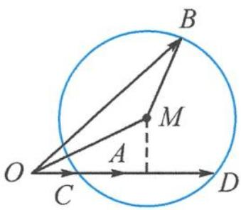

<!-- question-source:start -->
2. 解答 记 $a=\overrightarrow{OA}, b=\overrightarrow{OB}.$

因为 $\langle 2a - b, 2b - a \rangle = 120^{\circ}$ , 注意夹角必须共起点.

故调整系数为 $\langle 2a - b, \frac{a}{2} - b \rangle = \langle \overrightarrow{BD}, \overrightarrow{BC} \rangle = 60^\circ$ .

其中 $2a = \overrightarrow{OD}, \frac{a}{2} = \overrightarrow{OC}$ .

又因为 $\overrightarrow{CD} = \overrightarrow{OD} -\overrightarrow{OC} = \frac{3a}{2}$ ，故 $|\overrightarrow{CD}| = \frac{3}{2}$ 为定值.故由“定弦对定角”模型知，点 $B$ 位于答图中的圆 $M$ 的上半优弧，且圆的半径为 $\frac{\frac{3}{2}}{2\sin 60^{\circ}} = \frac{\sqrt{3}}{2}$ 所以 $|b|\leqslant |OM| + |MB| = \sqrt{\frac{25}{16} + \frac{3}{16}} +\frac{\sqrt{3}}{2}$ $= \frac{\sqrt{7} + \sqrt{3}}{2}.$

第2题答图
<!-- question-source:end -->

![[Q00034555A1]]
