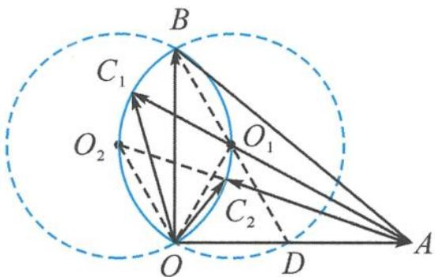

<!-- question-source:start -->
3. 解答 记 $a = \overrightarrow{OA}, b = \overrightarrow{OB}, c = \overrightarrow{OC}$ . 由向量 $c$ 与 $b - c$ 所成的夹角为 $\frac{\pi}{3}$ 知, $\angle OCB = \frac{2\pi}{3}$ .

由 $|OB| = \sqrt{3}$ 为定值知, 点 $C$ 的轨迹为两段圆弧 (挖掉两点), 两段圆弧分别以 $O_1, O_2$ 为圆心, 由 $2R = \frac{|OB|}{\sin \frac{2\pi}{3}} = 2$ 得 $R = 1$ .

第 3 题答图

如答图, 当 $A, O_1, C_1$ 三点共线时, $|AC|$ 取得最大值. 此时, 由 $\angle OBD = 30^\circ$ 知 $\angle ODB = 60^\circ$ , $|OD| = 1$ , $|AD| = 1$ , $|DO_1| = 1$ , 故 $|AO_1| = \sqrt{3}$ . 所以 $|AC|_{\max} = |AC_1| = \sqrt{3} + 1$ . 当 $A, O_2, C_2$ 三点共线时, $|AC|$ 取得最小值. 此时, 由 $\angle O_2OA = 120^\circ$ , $|OO_2| = 1$ , $|OA| = 2$ 知 $|AO_2| = \sqrt{7}$ , 所以 $|AC|_{\min} = |AC_2| = \sqrt{7} - 1$ .

故 $|c-a|\in[\sqrt{7}-1,\sqrt{3}+1]$ .
<!-- question-source:end -->

![[Q00034556A1]]
