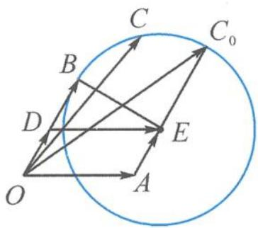

<!-- question-source:start -->
6. 解答 $c^2 - 2a \cdot c - b \cdot c + 4 = 0 \Rightarrow c^2 - (2a + b) \cdot c + \left(\frac{2a + b}{2}\right)^2 = \left(\frac{2a + b}{2}\right)^2 - 4$ .

$$
\left| c - \left(\frac {2 a + b}{2}\right) \right| = \sqrt {\left(\frac {2 a + b}{2}\right) ^ {2} - 4} = \sqrt {3}.
$$

记 $a = \overrightarrow{OA}, b = \overrightarrow{OB}, c = \overrightarrow{OC}, \frac{1}{2} b = \overrightarrow{OD}, a + \frac{1}{2} b = \overrightarrow{OE}$ .

第6题答图

如答图, 点 C 在以 E 为圆心, 以 $\sqrt{3}$ 为半径的圆上运动.

$$
(a + c) \cdot b = 2 + \overrightarrow {O B} \cdot \overrightarrow {O C}.
$$

因为 $\left|\overrightarrow{OB}\right|=2$ 为定值, 所以考虑转投影.

显然，当 $EC_0 \parallel OB$ 时， $\overrightarrow{OB} \cdot \overrightarrow{OC}$ 取得最大值 $2 \times (2 + \sqrt{3}) = 4 + 2\sqrt{3}$ .

故 $(a+c)\cdot b$ 的最大值为 $6+2\sqrt{3}$ .
<!-- question-source:end -->

![[Q00034559A1]]
