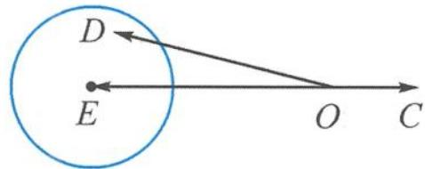

<!-- question-source:start -->
10. 解答 画法一：“以大换小”.

记 $a + 2b = \overrightarrow{OD}, -3c = \overrightarrow{OE}$ ，则 $|\overrightarrow{ED}| \leqslant 1$

即点 D 在圆 E 内(含圆), 如答图 1.

第10题答图1

所以 $|\overrightarrow{OD}| \in [2,4]$ , 即 $2 \leqslant |a + 2b| \leqslant 4$ . 又 $1 = ||a| - |2b|| \leqslant |a + 2b| \leqslant |a| + 2b| = 3$ , 所以 $2 \leqslant |a + 2b| \leqslant 3$ , 平方得 $4 \leqslant 1 + 4 + 4a \cdot b \leqslant 9$ , 所以 $-\frac{1}{4} \leqslant a \cdot b \leqslant 1$ . 画法二: “以大换小”. 记 $a + 2b = \overrightarrow{OD}, a + 2b + 3c = \overrightarrow{OE}$ , 则 $3c = \overrightarrow{DE}$ . 因为 $|a + 2b + 3c| = |\overrightarrow{OE}| \leqslant 1$ , 故点 $E$ 在单位圆

O 内, 如答图 2.

第10题答图2

又 $|\overrightarrow{DE}| = |3c| = 3$ ，所以点 $D$ 在以 $E$ 为圆心，3为半径的圆上.

所以 $2 \leqslant | |\overrightarrow{DE}| - |\overrightarrow{OE}| | \leqslant |\overrightarrow{OD}| \leqslant |\overrightarrow{DE}| + |\overrightarrow{OE}| \leqslant 4.$

又 $1 = ||a| - |2b|| \leqslant |\overrightarrow{OD}| = |a + 2b| \leqslant |a| + |2b| = 3,$

所以 $2 \leqslant |a + 2b| \leqslant 3$ ，故 $-\frac{1}{4} \leqslant a \cdot b \leqslant 1$ .
<!-- question-source:end -->

![[Q00034563A1]]
