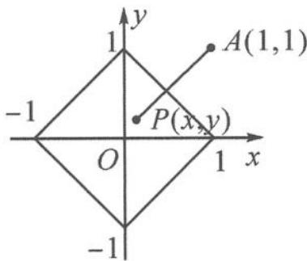

<!-- question-source:start -->
2. 解答 由复数的几何意义知, 复数 z 所对应的点 $P(x, y)$ 满足的可行域如答图所示.

第2题答图

$|z-1-i|$ 的几何意义为可行域内的点 $P(x,y)$ 到定点 A(1,1) 的距离，从而当点 P 取 $(-1,0)$ 或 $(0,-1)$ 时， $|AP|$ 取得最大值 $\sqrt{5}$ .
当点 P 取 $\left(\frac{1}{2},\frac{1}{2}\right)$ 时， $|AP|$ 取得最小值 $\frac{\sqrt{2}}{2}$ .
故 $|z-1-i|$ 的取值范围是 $\left[\frac{\sqrt{2}}{2},\sqrt{5}\right]$ .
<!-- question-source:end -->

![[Q00034571A1]]
