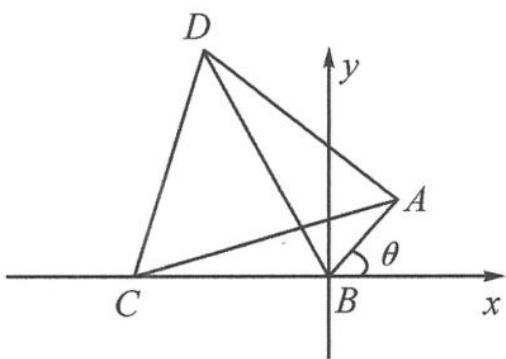

<!-- question-source:start -->
6. 解答 如答图, 以 B 为坐标原点建系.

第6题答图

设 $A(\cos \theta, \sin \theta), C(-2,0)$ ,

则 $\overrightarrow{CA} = (2 + \cos \theta, \sin \theta)$ 对应的复数为 $(2 + \cos \theta) + \mathrm{i}\sin \theta$ .

因为 $\overrightarrow{CD}$ 是 $\overrightarrow{CA}$ 按逆时针方向旋转 $60^\circ$ 得到的，所以 $\overrightarrow{CD}$ 对应的复数为 $[ (2 + \cos \theta) + \mathrm{i}\sin \theta] \cdot (\cos \frac{\pi}{3} + \mathrm{i}\sin \frac{\pi}{3}) = (1 + \frac{\cos \theta}{2} - \frac{\sqrt{3} \sin \theta}{2}) + (\sqrt{3} + \frac{\sqrt{3} \cos \theta}{2} + \frac{\sin \theta}{2})\mathrm{i},$ 即 $y_D = \sqrt{3} + \frac{\sqrt{3} \cos \theta}{2} + \frac{\sin \theta}{2}$ .

所以 $S_{\triangle BCD} = \frac{1}{2} \times 2 \times (\sqrt{3} + \frac{\sqrt{3} \cos \theta}{2} + \frac{\sin \theta}{2}) = \sqrt{3} + \sin (\theta + \frac{\pi}{3}) \leqslant \sqrt{3} + 1$ ，即 $\triangle BCD$ 面积最大值为 $\sqrt{3} + 1$ .
<!-- question-source:end -->

![[Q00034573A1]]
