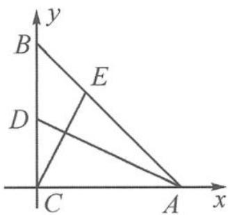

<!-- question-source:start -->
2.证明因为 $DG\bot BE,AC\bot BE$ ，所以 $DG / / AC.$ 设 $\overrightarrow{OA} = \lambda \overrightarrow{OD} (\lambda \neq 0)$ ，则 $\overrightarrow{AE} = \lambda \overrightarrow{DG}$ 同理， $\overrightarrow{AF} = \lambda \overrightarrow{DH}$ 于是 $\overrightarrow{FE} = \overrightarrow{AE} -\overrightarrow{AF} = \lambda (\overrightarrow{DG} -\overrightarrow{DH}) = \lambda \overrightarrow{HG},$ 所以 $\overrightarrow{HG} / / \overrightarrow{FE}$ ，即 $HG / / EF.$ 3.证明 $\overrightarrow{AF}\cdot \overrightarrow{BE} = \left(\frac{1}{2}\overrightarrow{AD} +\frac{1}{2}\overrightarrow{AE}\right)\cdot (\overrightarrow{BD}+$ $\overrightarrow{DE}) = \frac{1}{2} (\overrightarrow{AD}\cdot \overrightarrow{DE} +\overrightarrow{AE}\cdot \overrightarrow{BD}).$ 因为 $AE\bot DE$ ，所以 $\overrightarrow{AD}\cdot \overrightarrow{DE} = -|\overrightarrow{DE}|^2.$ 因为 $DE\bot AC$ ，所以 $\overrightarrow{AE}\cdot \overrightarrow{BD} = \overrightarrow{AE}\cdot \overrightarrow{DC}$ $= |\overrightarrow{AE}||\overrightarrow{EC} |.$ 故 $\overrightarrow{AF}\cdot \overrightarrow{BE} = \frac{1}{2} (-|\overrightarrow{DE}|^2 +|\overrightarrow{AE}||\overrightarrow{CE}|) = 0,$ 得 $AF\bot BE.$ 4.证明证法一：以CA，CB为基向量，则 $\overrightarrow{AD}\cdot \overrightarrow{CE} = (\overrightarrow{AC} +\overrightarrow{CD})\cdot (\overrightarrow{CB} +\overrightarrow{BE})$ $= (-\overrightarrow{CA} +\frac{1}{2}\overrightarrow{CB})\cdot (\overrightarrow{CB} +\frac{1}{3}\overrightarrow{BA})$ $= (-\overrightarrow{CA} +\frac{1}{2}\overrightarrow{CB})\cdot [\overrightarrow{CB} +\frac{1}{3} (\overrightarrow{CA} -\overrightarrow{CB})]$ $= (-\overrightarrow{CA} +\frac{1}{2}\overrightarrow{CB})\cdot (\frac{1}{3}\overrightarrow{CA} +\frac{2}{3}\overrightarrow{CB})$ $= -\frac{1}{3} |\overrightarrow{CA}|^2 -\frac{2}{3}\overrightarrow{CA}\cdot \overrightarrow{CB} +\frac{1}{6}\overrightarrow{CB}\cdot \overrightarrow{CA}+$ $\frac{1}{3} |\overrightarrow{CB}|^2.$ 因为 $CA = CB,CA\bot CB,$ 所以 $\overrightarrow{CB}\cdot \overrightarrow{CA} = 0, - \frac{1}{3} |\overrightarrow{CA}|^2 +\frac{1}{3} |\overrightarrow{CB}|^2 = 0.$ 所以 $\overrightarrow{CE}\cdot \overrightarrow{AD} = 0$ ，就是 $\overrightarrow{CE}\bot \overrightarrow{AD}$ ，故 $AD\bot CE.$ 证法二：建立如答图所示的直角坐标系，设 $CA$ $= CB = 6.$

第4题答图

由题意可知 $A(6,0), E(2,4), D(0,3)$ . 从而可得 $\overrightarrow{AD} = (-6,3), \overrightarrow{CE} = (2,4)$ , 可得 $\overrightarrow{AD} \cdot \overrightarrow{CE} = (-6) \times 2 + 3 \times 4 = 0$ , 可见 $\overrightarrow{CE} \perp \overrightarrow{AD}$ , 故 $AD \perp CE$ . 5. 证明 设 $AC = BD = 1, AB = t$ . 因为 $P$ 是 $BC$ 的中点, 所以 $\overrightarrow{AP} = \frac{\overrightarrow{AB} + \overrightarrow{AC}}{2}$ . 所以 $4|\overrightarrow{AP}|^2 = (\overrightarrow{AB} + \overrightarrow{AC})^2 = t^2 + t + 1$ . 因为 $\overrightarrow{BE} = \overrightarrow{BD} + \overrightarrow{DE}$ , 所以 $|\overrightarrow{BE}|^2 = |\overrightarrow{BD}|^2 + 2\overrightarrow{BD} \cdot \overrightarrow{DE} + |\overrightarrow{DE}|^2 = t^2 + t + 1$ . 所以 $|\overrightarrow{BE}|^2 = 4|\overrightarrow{AP}|^2, |\overrightarrow{BE}| = 2|\overrightarrow{AP}|$ , 即 $BE = 2AP$ .
<!-- question-source:end -->

![[Q00034575A1]]
