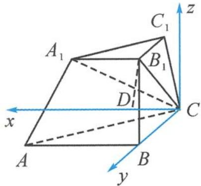

<!-- question-source:start -->
2. 分析 此题为切割体, 题干中也给出了“面面垂直”的条件. 不同的是, 此题图中未画出这两个平面的交线, 这就大大提高了本题的难度. 因此, 在建立坐标系之前, 应先作出平面 $ABC$ 与平面 $A_{1}B_{1}C$ 的交线.

解答 (1) 因为 $AB \perp BC$ , 所以以点 $C$ 为原点, 过点 $C$ 分别作 $AB$ 的平行线, 平面 $ABC$ 的垂线, 如答图所示建立空间直角坐标系.

第2题答图

过点 $B_{1}$ 作 $x$ 轴的垂线，垂足为 $D$ . 因为 $AB \parallel A_{1}B_{1}, CD \parallel AB,$ 所以 $CD \parallel A_{1}B_{1}$ ，即 $C, D, A_{1}, B_{1}$ 四点共面. 因为平面 $ABC \perp$ 平面 $A_{1}B_{1}CD,$ 平面 $ABC \cap$ 平面 $A_{1}B_{1}CD = CD, B_{1}D \perp CD,$ 所以 $B_{1}D \perp$ 平面 $ABCD.$ 不妨设 $BC = B_{1}C = 1$ ，则 $A(2,1,0), B(0,1,0), B_{1}\left(\frac{1}{2}, 0, \frac{\sqrt{3}}{2}\right)$ . 从而 $\overrightarrow{BB_1} = \left(\frac{1}{2}, -1, \frac{\sqrt{3}}{2}\right), \overrightarrow{AC} = (-2, -1, 0)$ ，$\overrightarrow{BB_1} \cdot \overrightarrow{AC} = -1 + 1 = 0,$ 所以 $BB_{1} \perp AC.$ (2) $\overrightarrow{BA} = (2,0,0), \overrightarrow{BB_{1}} = \left(\frac{1}{2}, -1, \frac{\sqrt{3}}{2}\right).$ 设平面 $ABB_{1}A_{1}$ 的一个法向量 $n = (x,y,z)$ ，则 $\left\{ \begin{array}{l} \overrightarrow{BA} \cdot n = 0, \\ \overrightarrow{BB_{1}} \cdot n = 0 \end{array} \right. \Rightarrow \left\{ \begin{array}{l} 2x = 0, \\ \frac{1}{2} x - y + \frac{\sqrt{3}}{2} z = 0. \end{array} \right.$ 令 $z = 2$ ，则 $y = \sqrt{3}$ ，即 $n = (0, \sqrt{3}, 2)$ 。又因为 $\overrightarrow{AC} = (-2, -1, 0)$ ，设 $AC$ 与平面 $ABB_{1}A_{1}$ 所成的角为 $\theta$ ，则 $\sin \theta = \left|\frac{-\sqrt{3}}{\sqrt{5} \times \sqrt{7}}\right| = \frac{\sqrt{105}}{35}$ 。故 $AC$ 与平面 $ABB_{1}A_{1}$ 所成角的正弦值为 $\frac{\sqrt{105}}{35}$ 。
<!-- question-source:end -->

![[Q00034584A1]]
