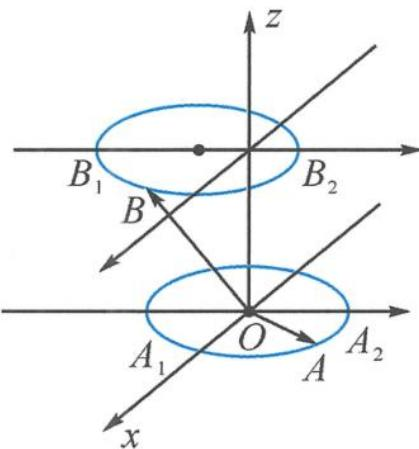

<!-- question-source:start -->
10. 解答 由 $\overrightarrow{OA} = (2a, 2b, 0), a^2 + b^2 = 1$ 知，点 $A$ 的轨迹是平面 $z = 0$ 上的圆心为原点、半径为 2 的圆.

$$
\overrightarrow {O B} = (c - 1, d, 1), c ^ {2} + d ^ {2} = 4
$$

第10题答图

如答图,从投影角度知:

当点 B 在点 $B_{1}$ ，点 A 在点 $A_{1}$ 处时， $\overrightarrow{OA} \cdot \overrightarrow{OB}$ 的最大值为 6；

当点 B 在点 $B_{1}$ ，点 A 在点 $A_{2}$ 处时， $\overrightarrow{OA} \cdot \overrightarrow{OB}$ 的最小值为 -6.

$$
\left| A B \right| _ {\max} = \left| A _ {2} B _ {1} \right| = \sqrt {1 ^ {2} + 5 ^ {2}} = \sqrt {2 6}.
$$

由于上面的圆投影到下面,与下面的圆有交点,故 $|AB|$ 的最小值即为平面z=0与z=1的距离,故 $|AB|_{\min}=1$ .故选B.

第12讲 表示与转化——向量与解析几何
<!-- question-source:end -->

![[Q00034591A1]]
