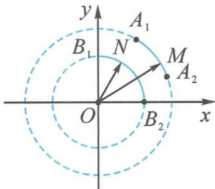

> [!faq]- 《浙大优辅《高中数学新体系 向量的秘密》》例题解析
>
> > [!success]- **【答案】** 详见解析
>
> > [!note]- **【分析】**
> > 本题未单列分析。
>
> > [!note]- **【解析】**
> > 解答 $a=\sqrt{10x-x^{2}-21}+\sqrt{7x-x^{2}-10}=\sqrt{(7-x)(x-3)}+\sqrt{(5-x)(x-2)}$ .
> > 设 $m=(\sqrt{7-x},\sqrt{x-2})$ , $n=(\sqrt{x-3},\sqrt{5-x})$ , $3 \leqslant x \leqslant 5$ , 则
> > $$
> > a = m \cdot n.
> > $$
> > 因为 $|\pmb{m}| = |\overrightarrow{OM}| = \sqrt{5}, |\pmb{n}| = |\overrightarrow{ON}| = \sqrt{2}$ , 所以随着 $x$ 的变化, 点 $M$ , $N$ 分别在圆弧 $A_{1}A_{2}, B_{1}B_{2}$ 上同时运动, 且点 $M$ 自点 $A_{2}$ 向点 $A_{1}$ 运动, 点 $N$ 自点 $B_{1}$ 向点 $B_{2}$ 运动, 如图8.2-1. 所以
> > $$
> > a = \boldsymbol {m} \cdot \boldsymbol {n} = \sqrt {5} \times \sqrt {2} \times \cos \angle M O N = \sqrt {1 0} \cos \angle M O N.
> > $$
> > 
> > 显然, 当 O, M, N 共线时, a 取得最大值 $\sqrt{10}$ . 当 x = 3 时, $\angle MON$ 最大, $\cos \angle MON$ 最小, 故 a 取得最小值 $\sqrt{2}$ .
> > 图8.2-1
> > 综上， $\sqrt{2} \leqslant a \leqslant \sqrt{10}$ .
> > ## 8.3 联想投影
> > 模长与数量积搭档就会产生投影的结果,所以遇到形如 $\frac{a_{1}b_{1}+a_{2}b_{2}}{\sqrt{a_{1}^{2}+a_{2}^{2}}}$ 的结构,可以联想向量投影.
