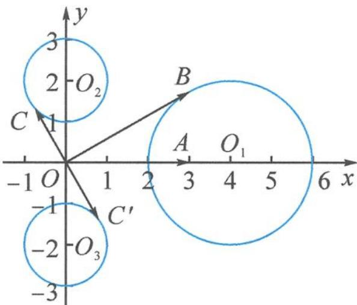

> [!faq]- 《浙大优辅《高中数学新体系 向量的秘密》》例题解析
>
> > [!success]- **【答案】** D
>
> > [!note]- **【分析】**
> > 本题未单列分析。
>
> > [!note]- **【解析】**
> > 解答 记 $a = \overrightarrow{OA}, b = \overrightarrow{OB}, c = \overrightarrow{OC}$ , 设 $A(3,0), B(x_0, y_0)$ , 则由 $|b| = 2 |b - a|$ 知 $|\overrightarrow{OB}| = 2 |\overrightarrow{AB}|$ , 即点 $B$ 的轨迹为阿氏圆 (图9-1), 圆心为 $O_1$ , 方程为
> > $$
> > (x _ {0} - 4) ^ {2} + y _ {0} ^ {2} = 4.
> > $$
> > 
> > 图9-1
> > 又条件 $|c| = \frac{1}{2} |b|$ , $\langle b, c \rangle = \frac{\pi}{2}, b \in A$ 表示 $|\overrightarrow{OC}| = \frac{1}{2} |\overrightarrow{OB}|$ , $\overrightarrow{OC} \perp \overrightarrow{OB}$ , 即 $\overrightarrow{OC}$ 是由 $\overrightarrow{OB}$ 旋转 $\frac{\pi}{2}$ , 且模长减半得到.
> > 不妨记 $b=\overrightarrow{OB}=(4+2\cos\theta,2\sin\theta)$ , $c=\overrightarrow{OC}$ ，向量涉及几何旋转问题，我们可以利用复数运算进行求解.
> > (1)逆时针旋转 $\frac{\pi}{2}$ , 且长度变为原来的 $\frac{1}{2}$ , 则向量 $c = \overrightarrow{OC}$ 所对应的复数为
> > $$
> > (4 + 2 \cos \theta + \mathrm{i} \cdot 2 \sin \theta) \times \frac {1}{2} \times \left(\cos \frac {\pi}{2} + \mathrm{i} \sin \frac {\pi}{2}\right) = - \sin \theta + (2 + \cos \theta) \mathrm{i}.
> > $$
> > 故向量 $c=\overrightarrow{OC}=(-\sin\theta,2+\cos\theta)$ ，即终点 C 在圆 $x^{2}+(y-2)^{2}=1$ 上，其圆心为 $O_{2}(0,2)$ ，半径为 $r_{2}=1$ 。记 $m=\overrightarrow{OM}, n=\overrightarrow{ON}$ ，因为 $m\in A, n\in B$ ，所以 M 和 N 分别在 $\odot O_{1}$ 和 $\odot O_{2}$ 上，
> > $$
> > | \boldsymbol {m} - \boldsymbol {n} | = | \overrightarrow {N M} | \leqslant | \overrightarrow {O _ {1} O _ {2}} | + r _ {1} + r _ {2} = 2 \sqrt {5} + 3.
> > $$
> > (2)顺时针旋转 $\frac{\pi}{2}$ , 且长度变为原来的 $\frac{1}{2}$ , 则向量 $c = \overrightarrow{OC}$ 所对应的复数为
> > $$
> > (4 + 2 \cos \theta + \mathrm{i} \cdot 2 \sin \theta) \times \frac {1}{2} \times \left[ \cos \left(- \frac {\pi}{2}\right) + \mathrm{i} \sin \left(- \frac {\pi}{2}\right) \right] = \sin \theta + (- 2 - \cos \theta) \mathrm{i}.
> > $$
> > 故向量 $c = \overrightarrow{OC} = (\sin \theta, -2 - \cos \theta)$ ，即终点 $C$ 在圆 $x^{2} + (y + 2)^{2} = 1$ 上，其圆心为 $O_{3}(0, -2)$ ，半径为 $r_{3} = 1$ 。所以
> > $$
> > | \boldsymbol {m} - \boldsymbol {n} | = | \overrightarrow {N M} | \leqslant | \overrightarrow {O _ {1} O _ {3}} | + r _ {1} + r _ {3} = 2 \sqrt {5} + 3.
> > $$
> >
> > 故选 **D**.
